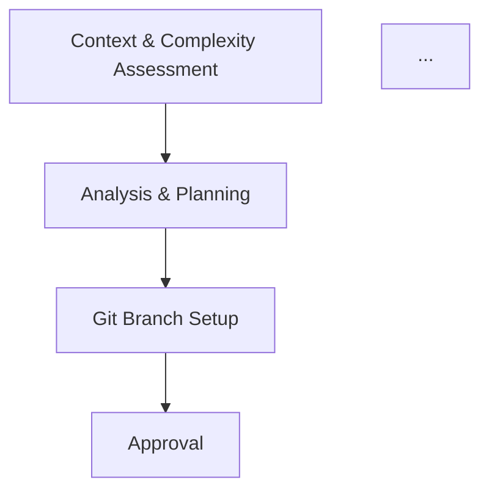

# YAML Workflow System

## Обзор

YAML-based workflow system для machine-readable определения task execution flow.

## Файлы

### 1. workflow-universal.yaml
**Source of truth** для всех task-lite templates.

**Содержит:**
- Phase definitions (phase_0 - phase_5c)
- Skill references с inputs/outputs
- Dependencies между phases
- Data flow между phases
- Validation gates
- Complexity-based rules
- Project-specific overrides

**Преимущества:**
- ✅ Machine-readable (можно валидировать через JSON Schema)
- ✅ Auto-generate documentation из YAML
- ✅ Single source of truth (изменения в одном месте)
- ✅ Inheritance для project-specific overrides

### 2. workflow-schema.json
JSON Schema для валидации workflow-universal.yaml.

**Проверяет:**
- Required fields присутствуют
- Phase types корректны (mandatory/conditional/optional)
- Dependencies ссылаются на существующие phases
- Output schema соответствует ожиданиям

### 3. YAML-WORKFLOW-README.md
Документация (этот файл).

## Использование

### Валидация YAML

```bash
# Установить ajv-cli (JSON Schema validator)
npm install -g ajv-cli

# Конвертировать YAML в JSON
pip install pyyaml
python -c "import yaml, json; print(json.dumps(yaml.safe_load(open('workflow-universal.yaml'))))" > workflow.json

# Валидация
ajv validate -s workflow-schema.json -d workflow.json
```

### Чтение в adaptive-workflow skill

```typescript
// adaptive-workflow может читать YAML для runtime orchestration
import yaml from 'yaml';
import fs from 'fs';

const workflowDef = yaml.parse(fs.readFileSync('workflow-universal.yaml', 'utf8'));

// Определить, какие phases выполнять based on complexity
const complexity = detectComplexity();
const phasesToSkip = workflowDef.complexity_rules[complexity].skip_phases;

// Execute phases
for (const phase of workflowDef.execution_order.linear) {
  if (!phasesToSkip.includes(phase)) {
    await executePhase(workflowDef.phases[phase]);
  }
}
```

### Project-specific overrides

```yaml
# Для ClickHouse проекта
phases:
  phase_1_5:
    skill:
      inputs:
        base_branch: "master"  # Override from "main"
```

Применяется через:
```typescript
const projectOverrides = workflowDef.project_overrides.clickhouse;
const phase15 = { ...workflowDef.phases.phase_1_5, ...projectOverrides.phase_1_5 };
```

## Генерация Markdown из YAML

Можно автоматически генерировать human-readable Markdown из YAML:

```python
# generate-workflow-docs.py
import yaml

with open('workflow-universal.yaml') as f:
    workflow = yaml.safe_load(f)

# Generate Markdown
print("# Execution Flow\n")
for phase_id in workflow['execution_order']['linear']:
    phase = workflow['phases'][phase_id]
    print(f"## {phase['name']}")
    print(f"{phase['description']}\n")

    if 'skills' in phase:
        for skill in phase['skills']:
            print(f"- @skill:{skill['name']}")
            if 'inputs' in skill:
                print(f"  - Inputs: {skill['inputs']}")
            if 'output' in skill:
                print(f"  - Output: {skill['output']}")
```

**Результат:**
```markdown
# Execution Flow

## Context & Complexity Assessment
Detect project context and determine task complexity

- @skill:context-awareness
  - Output: project_context
- @skill:adaptive-workflow
  - Inputs: ['project_context', 'lsp_status?', 'library_docs?']
  - Output: {'complexity', 'workflow_mode'}

## Analysis & Planning
...
```

## Генерация Mermaid диаграммы

```python
# generate-mermaid.py
import yaml

with open('workflow-universal.yaml') as f:
    workflow = yaml.safe_load(f)

print("graph TD")
for phase_id, phase in workflow['phases'].items():
    print(f"  {phase_id}[{phase['name']}]")
    for dep in phase['dependencies']:
        print(f"  {dep} --> {phase_id}")
```

**Результат:**


## Сравнение: ASCII-art vs YAML

| Aspect | ASCII-art (template) | YAML (source of truth) |
|--------|---------------------|------------------------|
| **Читаемость** | ⭐⭐⭐⭐⭐ | ⭐⭐⭐ |
| **Редактирование** | ⭐⭐⭐⭐⭐ | ⭐⭐⭐ |
| **Валидация** | ❌ Manual | ✅ JSON Schema |
| **Consistency** | ❌ Manual sync (6 files) | ✅ Single source |
| **Auto-generation** | ❌ | ✅ Markdown, Mermaid |
| **Runtime usage** | ❌ | ✅ adaptive-workflow reads |
| **Dependencies** | ❌ Implicit | ✅ Explicit graph |
| **Overrides** | ❌ Copy-paste | ✅ Inheritance |

## Рекомендуемый workflow

1. **Редактировать** workflow-universal.yaml (source of truth)
2. **Валидировать** через JSON Schema
3. **Генерировать** Markdown для human documentation
4. **Встроить** generated Markdown в task-lite templates
5. **Использовать** YAML в adaptive-workflow для runtime orchestration

## Миграция

### Шаг 1: Создать YAML definition ✅
Создан workflow-universal.yaml с полным определением workflow.

### Шаг 2: Обновить task-lite templates
Заменить ASCII-art на ссылку:

```markdown
## Execution Flow

See machine-readable definition: `@shared:workflow-universal.yaml`

### Quick Reference

[Auto-generated Markdown from YAML]
```

### Шаг 3: Обновить adaptive-workflow
Читать YAML вместо hardcoded logic:

```typescript
const workflow = loadWorkflow('workflow-universal.yaml');
const phasesToRun = determinePhasesForComplexity(complexity, workflow);
```

### Шаг 4: Проектные overrides
Создать task-lite-clickhouse.yaml:

```yaml
extends: workflow-universal.yaml
overrides:
  phase_1_5.skill.inputs.base_branch: "master"
```

## Future Enhancements

- [ ] Visual workflow editor (YAML → GUI)
- [ ] Workflow simulator (test phases locally)
- [ ] Metrics collection (phase execution times)
- [ ] A/B testing (compare workflow variants)

---

**Version:** 1.0.0
**Last Updated:** 2026-01-27
