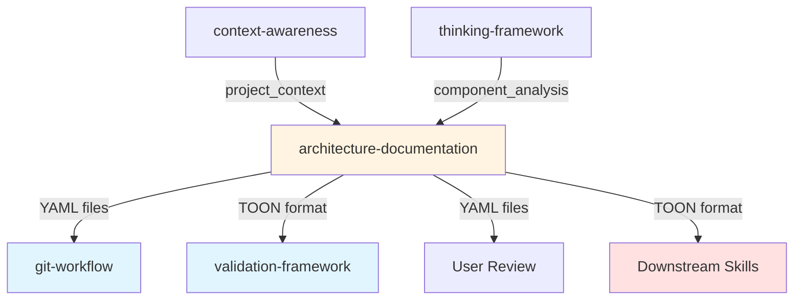

# Architecture Documentation Skill

## Purpose

Автоматизирует создание архитектурной документации проекта с генерацией:
- **YAML документов** (human-facing, в git)
- **Mermaid диаграмм** (dependency graphs, data flows)
- **TOON форматов** (LLM-facing, inter-skill communication, 30-60% token savings)

## When to Use

### Auto-invocation
- После Phase 1 (Analysis) в complex проектах
- При внедрении новых архитектурных компонентов
- После major refactoring

### Manual invocation
```
/architecture-documentation
@skill:architecture-documentation
```

### Use when
- Документация архитектуры отсутствует или устарела
- Нужна визуализация dependency graph
- Требуется понимание component relationships
- Project onboarding для новых разработчиков
- Architecture review или audit

---

## Workflow (4 Phases)

### Phase 1: Discovery & Analysis

**Input:** Project context from `@skill:context-awareness`

**Actions:**
1. **Detect complexity:**
   - Minimal: < 10 files, 1-5 components
   - Standard: 10-50 files, 5-20 components
   - Complex: > 50 files, > 20 components

2. **Discover components:**
   Use Glob/Grep for language-specific patterns:

   | Language | Search Patterns | Entry Points |
   |----------|----------------|--------------|
   | **JS/TS** | `export class`, `export function`, `module.exports` | `src/index.{js,ts}`, `src/main.{js,ts}` |
   | **Python** | `class`, `def` in `__init__.py`, `from X import Y` | `__main__.py`, `app.py`, `main.py` |
   | **Go** | `package`, `type`, `func` | `main.go` |
   | **Rust** | `pub mod`, `pub struct`, `pub fn` | `src/main.rs`, `src/lib.rs` |
   | **Bash** | `function`, `(){`, `source` | Main script files |

3. **Extract dependencies:**
   - Parse import/require statements via Grep
   - Build dependency map: `component_id → [dependency_ids]`
   - Classify: required (code), dev (tests), optional (dynamic)

4. **Detect patterns:**
   Analyze directory structure for architectural patterns:
   - **Layered:** `controllers/`, `services/`, `models/`, `repositories/`
   - **MVC:** `models/`, `views/`, `controllers/`
   - **Microservices:** Multiple `package.json` or separate `services/`
   - **Hexagonal:** `ports/`, `adapters/`, `domain/`
   - **Event-driven:** `events/`, `subscribers/`, `publishers/`
   - **Modular:** Skills system with subdirectories

**Output:** Component list, dependency map, detected patterns

---

### Phase 2: Documentation Generation

**Actions:**
1. **Select template:**
   - Minimal → `@template:architecture-lite`
   - Standard/Complex → `@template:architecture-full`

2. **Generate YAML files:**
   - `/docs/architecture/overview.yaml` - Main architecture document
   - `/docs/architecture/dependency-graph.yaml` - Graph structure (if complex)
   - `/docs/architecture/components/{id}.yaml` - Per-component (if complex)

3. **Generate Mermaid diagrams:**
   - `/docs/architecture/diagrams/dependency-graph.md` - Component dependencies
   - `/docs/architecture/diagrams/data-flow-*.md` - Data flow diagrams (if exist)
   - Use color coding by layer:
     ```
     presentation: #e1f5ff (light blue)
     business: #fff4e1 (light yellow)
     data: #ffe1e1 (light red)
     infrastructure: #e1ffe1 (light green)
     external: #f0f0f0 (gray)
     ```

4. **Generate TOON formats** (NEW):
   See [TOON Integration](#toon-integration) section below.

5. **Generate README.md:**
   - `/docs/architecture/README.md` - Index with embedded Mermaid diagrams

**Output:** YAML files, Mermaid diagrams, README

---

### Phase 3: Validation

**Before writing files, run validation checklist:**

#### ✅ Validation Checklist

- [ ] **Dependency references:** All referenced component IDs exist
- [ ] **Circular dependencies:** Detected and marked (A ↔ B)
- [ ] **ID format:** Kebab-case (`^[a-z][a-z0-9-]*$`)
- [ ] **Descriptions:** Not placeholders (min 10 chars, not "TODO"/"Component")
- [ ] **Component count:** Matches discovered count
- [ ] **Dependency count:** Matches extracted edges
- [ ] **TOON syntax:** Valid if generated (see `validateToon()`)
- [ ] **Round-trip test:** TOON ↔ JSON lossless (see `roundTripTest()`)

**Critical:** STOP if validation fails. Fix issues before proceeding.

---

### Phase 4: Output & Summary

**Actions:**
1. **Create directory structure:**
   ```bash
   mkdir -p /docs/architecture/components
   mkdir -p /docs/architecture/diagrams
   ```

2. **Write files:**
   - YAML documents
   - Markdown with Mermaid diagrams
   - README with index

3. **Generate structured output:**
   See [Output Format](#output-format) section.

4. **Display summary:**
   - Files created (with paths)
   - Component & dependency counts
   - Detected patterns
   - Warnings (circular deps, missing descriptions)
   - TOON token savings (if applicable)
   - Next steps for user

**Output:** Structured JSON + user-friendly summary

---

## TOON Integration

### What is TOON?

**TOON (Token-Oriented Object Notation)** - компактный формат для LLM коммуникации с **30-60% token savings**.

**Key Benefits:**
- ✅ 30-60% token reduction (components: 39.1%, graphs: 48.9%)
- ✅ Improved LLM parsing accuracy (73.9% vs 69.7% for JSON)
- ✅ Lossless round-trip conversion (TOON ↔ JSON)
- ✅ Ideal for tabular data (components, edges, quality attributes)

**For full TOON documentation, see:**
- `@skill:toon-skill` - Centralized TOON API and converter
- `@shared:TOON-REFERENCE.md` - Format specification
- `examples/TOON-INTEGRATION-GUIDE.md` - Integration tutorials

### When to Use TOON

**✅ Use TOON for:**
- Structured output between skills (inter-skill communication)
- Arrays >= 5 elements (token savings significant)
- Large datasets (> 10 components, > 20 edges)
- Token-constrained environments

**❌ NOT for:**
- Human-facing files in git (use YAML for tooling)
- Deeply nested structures (> 3 levels)
- Small datasets (< 5 elements, savings minimal)

### TOON Generation Workflow

```javascript
// Import from centralized toon-skill
import {
  arrayToToon,           // Convert array to TOON table
  nestedToToon,          // Convert nested structure (dependency graphs)
  calculateTokenSavings, // Measure token reduction
  validateToon,          // Validate TOON syntax
  roundTripTest          // Test lossless conversion
} from '../toon-skill/converters/toon-converter.mjs';

// 1. Convert components (if >= 5)
const componentsToon = arrayToToon('components', components,
  ['id', 'name', 'type', 'path', 'description', 'layer']);

// 2. Convert dependency graph
const graphToon = nestedToToon('dependency_graph', {
  nodes: { items: nodes, fields: ['id', 'label', 'type', 'layer'] },
  edges: { items: edges, fields: ['from', 'to', 'type', 'description'] }
});

// 3. Calculate token savings
const stats = calculateTokenSavings({ components, dependency_graph: { nodes, edges } });

// 4. Validate before embedding
const validation = validateToon(componentsToon);
if (!validation.valid) throw new Error(validation.error);

// 5. Embed in structured output
return {
  architecture_documentation: {
    formats: {
      toon: {
        components_toon: componentsToon,
        dependency_graph_toon: graphToon,
        token_savings: stats.savedPercent,
        size_comparison: `YAML: ${stats.jsonTokens} tokens, TOON: ${stats.toonTokens} tokens`
      }
    }
  }
};
```

### Token Savings Examples

**Real benchmarks from iclaude project:**

| Data Type | JSON Tokens | TOON Tokens | Savings |
|-----------|-------------|-------------|---------|
| **Components** (3 items) | 202 | 123 | **39.1%** |
| **Dependency Graph** | 223 | 114 | **48.9%** |
| **Data Flow** (5 steps) | ~180 | ~95 | **47.2%** |
| **Quality Attributes** (5 items) | ~150 | ~85 | **43.3%** |

**Large dataset (15 components, 42 edges):**
- YAML: 8,542 tokens
- TOON: 4,951 tokens
- **Savings: 3,591 tokens (-42.0%)**

---

## Output Format

### Structured Output (JSON)

**Dual-format output (YAML + TOON):**

```json
{
  "architecture_documentation": {
    "status": "success|partial|failed",
    "output_directory": "/docs/architecture",
    "formats": {
      "yaml": {
        "files_created": ["overview.yaml", "diagrams/dependency-graph.md"],
        "output_directory": "/docs/architecture"
      },
      "toon": {
        "components_toon": "components[15]{id,name,type,path,description,layer}:\n  proxy-mgmt,Proxy Management,module,...",
        "dependency_graph_toon": "dependency_graph:\n  nodes[15]{id,label,type,layer}:\n    ...\n  edges[42]{from,to,type,description}:\n    ...",
        "token_savings": "42%",
        "size_comparison": "YAML: 8542 tokens, TOON: 4951 tokens"
      }
    },
    "component_count": 15,
    "dependency_count": 42,
    "detected_patterns": ["layered", "dependency-injection"],
    "warnings": ["circular-dependency: auth-service ↔ user-service"],
    "complexity": "minimal|standard|complex",
    "mermaid_diagrams_generated": 2
  }
}
```

**Schema validation:** `@schema:architecture-output`

### Documentation Files (YAML)

- `/docs/architecture/overview.yaml` - Main architecture specification
- `/docs/architecture/components/*.yaml` - Individual component docs (if complex)
- `/docs/architecture/dependency-graph.yaml` - Dependency relationships (if complex)
- `/docs/architecture/diagrams/dependency-graph.md` - Markdown with Mermaid visualization
- `/docs/architecture/diagrams/data-flow-*.md` - Data flow diagrams with Mermaid
- `/docs/architecture/README.md` - Architecture documentation index

---

## Templates

### YAML Templates (Human-facing)

- `@template:architecture-lite` - Minimal (< 10 components)
  - File: `templates/architecture-lite.yaml`
- `@template:architecture-full` - Complete documentation
  - File: `templates/architecture-full.yaml`
- `@template:component` - Single component spec
  - File: `templates/component.yaml`
- `@template:dependency-graph` - Graph structure only
  - File: `templates/dependency-graph.yaml`
- `@template:dependency-graph.md` - Mermaid visualization
  - File: `templates/dependency-graph.md`
- `@template:data-flow.md` - Data flow diagram
  - File: `templates/data-flow.md`
- `@template:README.md` - Documentation index
  - File: `templates/README.md`

### TOON Templates (LLM-facing, token-efficient)

- `@template:components.toon` - Components tabular format (39.1% savings)
  - File: `templates/toon/components.toon.template`
- `@template:dependency-graph.toon` - Graph with nodes + edges (48.9% savings)
  - File: `templates/toon/dependency-graph.toon.template`
- `@template:data-flow.toon` - Data flow steps (47.2% savings)
  - File: `templates/toon/data-flow.toon.template`
- `@template:quality-attributes.toon` - Quality attributes (43.3% savings)
  - File: `templates/toon/quality-attributes.toon.template`

**All TOON templates achieve 30-60% token savings compared to JSON/YAML.**

---

## Schemas

- `@schema:architecture` - Architecture YAML validation
  - File: `schemas/architecture.schema.json`
- `@schema:architecture-output` - Structured output validation (dual-format)
  - File: `schemas/architecture-output.schema.json`
- `@schema:component` - Component YAML validation
  - File: `schemas/component.schema.json`

---

## Examples

### Real Project Examples

**iclaude project** (bash script with modules):
- Components: `examples/toon/components.toon.example` (6 components)
- Dependency graph: `examples/toon/dependency-graph.toon.example` (6 nodes, 7 edges)
- Data flow: `examples/toon/data-flow.toon.example` (user launch workflow)
- Quality attributes: `examples/toon/quality-attributes.toon.example` (5 attributes)

### Structured Output Example

- `examples/structured-output-example.json` - Complete JSON with dual-format output

### Test Files

- `examples/test-components.json` - JSON input
- `examples/test-components.toon` - TOON output
- `examples/test-dependency-graph.json` - Graph JSON
- `examples/test-dependency-graph.toon` - Graph TOON
- `examples/test-dependency-graph-roundtrip.json` - Round-trip validation

### Guides

- `examples/TOON-INTEGRATION-GUIDE.md` - Complete TOON integration tutorial
- `examples/token-monitoring-guide.md` - Token optimization tracking
- `examples/workflow-example.md` - End-to-end workflow walkthrough
- `examples/benchmarks.md` - Token savings benchmarks

---

## Safety Rules

### ⚠️ What NOT to Do

#### 1. Do NOT modify existing architecture files without validation
- **Why:** May break references, introduce circular dependencies
- **Instead:** Validate changes before writing

#### 2. Do NOT generate TOON for small datasets (< 5 elements)
- **Why:** Token savings minimal (5-15%), adds complexity
- **Instead:** Use JSON only for small arrays

#### 3. Do NOT commit TOON files to git
- **Why:** Poor tooling support, human readability
- **Instead:** Use YAML for human-facing docs, TOON for structured output only

#### 4. Do NOT use placeholders in descriptions
- **Why:** Reduces documentation value
- **Instead:** Infer descriptions from code/comments or mark as "TODO (to be documented)"

#### 5. Do NOT skip validation checklist
- **Why:** Invalid output breaks downstream skills
- **Instead:** Run all validation checks before writing files

#### 6. Do NOT generate diagrams with > 50 nodes
- **Why:** Mermaid rendering becomes unreadable
- **Instead:** Split into multiple diagrams by layer or module

#### 7. Do NOT hardcode paths
- **Why:** Breaks portability
- **Instead:** Use relative paths from `project_context.project_root`

#### 8. Do NOT ignore circular dependencies
- **Why:** Indicates architectural smell
- **Instead:** Mark as warning and highlight in diagram (red edges)

---

## Data Flow & Integration

### Input Dependencies

```
@skill:context-awareness
  ↓ provides: project_context
    - language, framework, project_root
    - package_manager, structure
    - entry_points, patterns

@skill:thinking-framework
  ↓ provides: component_analysis
    - Reasoning about architecture
    - Pattern detection logic
```

### Output Consumers

```
architecture_documentation (YAML files)
  ↓ consumed by:
    - @skill:validation-framework (validate architecture quality)
    - @skill:git-workflow (commit documentation)
    - User (review and modify YAML files)

architecture_documentation (TOON format)
  ↓ consumed by:
    - Downstream skills (token-efficient data passing)
    - @skill:code-review (component relationships)
    - @skill:pr-automation (architecture change detection)
```

### Workflow Integration Diagram



---

## Best Practices

### 1. Always validate before writing
Run validation checklist (Phase 3) before creating files.

### 2. Use hybrid output (YAML + TOON)
- YAML for git-committed human-facing docs
- TOON for inter-skill communication (30-60% token savings)

### 3. Leverage TOON for large datasets
Use TOON when:
- Arrays >= 5 elements
- Dependency graphs with > 10 nodes
- Token efficiency matters

### 4. Keep diagrams focused
Split large diagrams (> 50 nodes) into:
- By architectural layer
- By module/service
- By data flow

### 5. Document architectural decisions
In `overview.yaml`, include:
- Why patterns were chosen
- Trade-offs considered
- Alternative approaches rejected

### 6. Update docs after refactoring
Re-run skill after major changes:
- New components added
- Dependencies changed
- Patterns evolved

### 7. Mark circular dependencies explicitly
Use red edges in Mermaid diagrams:
```mermaid
A -->|depends on| B
B -.->|circular| A
style B stroke:#ff0000
```

---

## Troubleshooting

### Issue: Circular dependencies detected

**Solution:**
1. Mark in diagram with red edges
2. Add to `warnings` array
3. Document in `overview.yaml` with rationale
4. Consider refactoring if smell detected

### Issue: TOON validation fails

**Diagnosis:**
```javascript
import { validateToon } from '../toon-skill/converters/toon-converter.mjs';
const result = validateToon(toonString);
console.log(result.errors); // View specific errors
```

**Common causes:**
- Missing array declaration: `arrayName[N]{fields}:`
- Incorrect CSV format (missing commas)
- Quoted strings not escaped

### Issue: Mermaid diagram too large

**Solution:**
1. Split by layer (presentation, business, data)
2. Create separate flow diagrams
3. Use subgraphs for grouping
4. Limit to max 50 nodes per diagram

### Issue: Token savings lower than expected

**Diagnosis:**
```javascript
import { calculateTokenSavings } from '../toon-skill/converters/toon-converter.mjs';
const stats = calculateTokenSavings(data);
console.log(`Savings: ${stats.savedPercent}`); // Expected: 30-60%
```

**Common causes:**
- Array too small (< 5 elements) → Use JSON
- Deeply nested structure (> 3 levels) → TOON not optimal
- Irregular schema → TOON requires consistent structure

---

## Further Reading

### Official Documentation
- **TOON Specification:** https://toonformat.dev/spec
- **NPM Package:** [@toon-format/toon](https://www.npmjs.com/package/@toon-format/toon)
- **TOON CLI:** `@toon-format/cli` (installed in `.nvm-isolated/npm-global/bin/toon`)

### Related Skills
- `@skill:toon-skill` - Centralized TOON API and converter
- `@skill:context-awareness` - Project context detection
- `@skill:thinking-framework` - Reasoning patterns
- `@skill:validation-framework` - Architecture quality validation
- `@skill:git-workflow` - Documentation commit

### Shared References
- `@shared:TOON-REFERENCE.md` - TOON format specification
- `@shared:TASK-STRUCTURE.md` - Task structure with TOON optimization

---

## Version History

**v1.3.0 (2026-01-26):** Optimized documentation structure
**v1.2.0 (2026-01-23):** TOON format integration
**v1.1.0 (2026-01-20):** Markdown with embedded Mermaid
**v1.0.0 (2025-11-23):** Initial release
