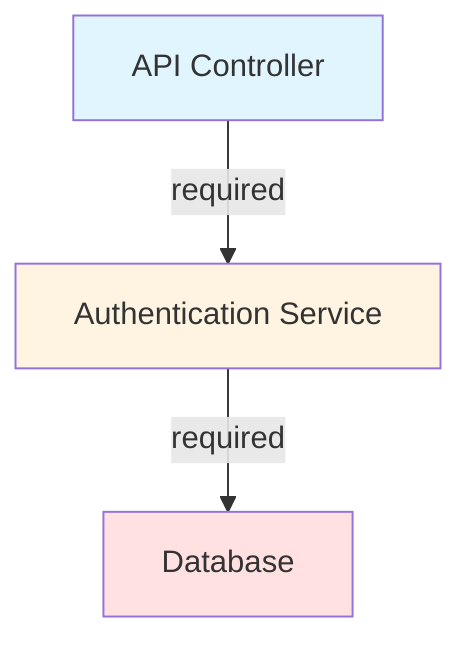
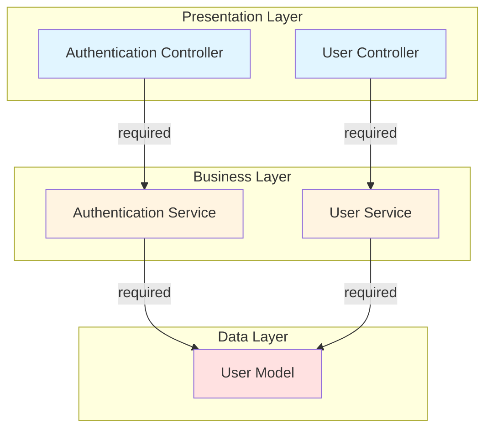

# Dependency Graph Template

> This is a template for generating component dependency diagrams.
> The Mermaid diagram below is embedded in Markdown format for better GitHub compatibility.

## Basic Example



## Example: Layered Architecture



## Color Scheme

| Layer | Color | Hex Code |
|-------|-------|----------|
| Presentation | Light Blue | #e1f5ff |
| Business | Light Yellow | #fff4e1 |
| Data | Light Red | #ffe1e1 |
| Infrastructure | Light Green | #e1ffe1 |
| External | Gray | #f0f0f0 |

## Template Syntax

When generating diagrams, use this syntax:

```
graph TD
    component-id[Component Name]

    component1 -->|dependency-type| component2

    style component-id fill:#color-hex
```

**Placeholders to replace:**
- `component-id` - kebab-case component identifier (e.g., `auth-service`, `api-controller`)
- `Component Name` - human-readable name (e.g., `Authentication Service`)
- `dependency-type` - one of: `required`, `optional`, `dev`
- `#color-hex` - layer color (see Color Scheme table below)

## Usage

This template is used by the `architecture-documentation` skill to generate dependency graphs. The skill will:

1. Analyze codebase structure to identify components
2. Extract dependencies from import/require statements
3. Generate component nodes with kebab-case IDs
4. Create edges with appropriate dependency types
5. Apply styling based on architectural layer detection
6. Generate subgraphs for layered architectures (if detected)

The output is saved as `docs/architecture/diagrams/dependency-graph.md` with embedded Mermaid code blocks.
