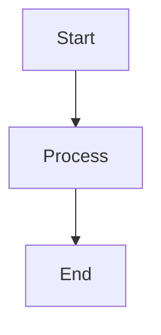

# Markdown Guidelines for PRD Documentation

Этот документ описывает правила и best practices для создания PRD документации в формате Markdown.

## 1. Heading Hierarchy

### 1.1 Структура заголовков

**Правило**: Используйте последовательную иерархию заголовков без пропусков уровней.

```markdown
# Document Title (H1) - только один на документ
## Major Section (H2)
### Subsection (H3)
#### Detail Level (H4)
##### Rarely Used (H5)
###### Avoid if Possible (H6)
```

**Best Practices:**
- **H1** - только для названия документа (один раз)
- **H2** - основные разделы (Goals, Requirements, Technical)
- **H3** - подразделы (Functional Requirements, Non-Functional Requirements)
- **H4** - детализация (Performance, Security, Scalability)
- **H5-H6** - избегайте, слишком глубокая вложенность

**Плохо:**
```markdown
# Title
### Subsection (пропущен H2!)
## Section (нарушена последовательность!)
```

**Хорошо:**
```markdown
# Title
## Section
### Subsection
#### Detail
```

### 1.2 Naming Conventions

- Используйте **заглавные буквы** для важных слов (Title Case)
- Избегайте специальных символов в заголовках (для anchor links)
- Используйте числовую нумерацию для порядка разделов

```markdown
## 2. Goals and Scope
### 2.1 Business Goals
### 2.2 Success Metrics
```

---

## 2. Lists

### 2.1 Unordered Lists

Используйте `-` (дефис) для единообразия.

```markdown
- First item
- Second item
  - Nested item (2 пробела отступ)
  - Another nested item
- Third item
```

**Best Practices:**
- Начинайте каждый пункт с заглавной буквы
- Используйте точку в конце, если пункт - полное предложение
- Вложенные списки: 2 пробела отступа на уровень

### 2.2 Ordered Lists

Используйте `1.` для всех пунктов (авто-нумерация).

```markdown
1. First step
1. Second step
   1. Substep A (3 пробела отступ)
   1. Substep B
1. Third step
```

### 2.3 Task Lists (Checkboxes)

Для acceptance criteria, checklists.

```markdown
## Acceptance Criteria
- [ ] Given user is logged in, when...
- [x] Given user has admin role, when... (completed)
- [ ] Given API returns error, when...
```

---

## 3. Tables

### 3.1 Basic Table Format

```markdown
| Column 1 | Column 2 | Column 3 |
|----------|----------|----------|
| Row 1    | Data     | Value    |
| Row 2    | Data     | Value    |
```

### 3.2 Alignment

```markdown
| Left-aligned | Center-aligned | Right-aligned |
|:-------------|:--------------:|--------------:|
| Text         | Text           | 123.45        |
| More text    | More text      | 67.89         |
```

### 3.3 Complex Tables (with formatting)

```markdown
| Feature | Priority | Effort | Status |
|---------|----------|--------|--------|
| **User Auth** | P0 | M | ✅ Done |
| _Dashboard_ | P1 | L | 🚧 In Progress |
| ~~Old Feature~~ | P2 | - | ❌ Deprecated |
```

**Best Practices:**
- Выравнивайте по левому краю для текста
- Выравнивайте по правому краю для чисел
- Используйте центрирование для коротких меток (Status, Priority)
- Добавляйте emoji для визуальной ясности (✅ ❌ 🚧 ⚠️)

---

## 4. Links and References

### 4.1 Internal Links (Cross-References)

**Relative paths** для ссылок между PRD файлами:

```markdown
See [Functional Requirements](./06-functional-requirements/overview.md) for details.

Refer to [Feature: User Authentication](./06-functional-requirements/features/feature-user-auth.md).

Jump to [Technical Architecture](./09-technical-requirements/architecture.md#database-schema).
```

### 4.2 Anchor Links

```markdown
## 2.1 Business Goals {#business-goals}

Later in document:
See [Business Goals](#business-goals) section above.
```

**Auto-generated anchors** (GitHub/CommonMark):
```markdown
## 2.1 Business Goals

Link to:
[Business Goals](#21-business-goals)
```

### 4.3 External Links

```markdown
See [Figma Design](https://figma.com/file/xyz) for mockups.

API Documentation: [Stripe API](https://stripe.com/docs/api)
```

### 4.4 Reference-Style Links

Для повторяющихся ссылок:

```markdown
[product roadmap][roadmap]
[roadmap timeline][roadmap]

[roadmap]: ./10-roadmap.md "Product Roadmap"
```

---

## 5. Code Blocks and Formatting

### 5.1 Inline Code

Используйте обратные кавычки для:
- Технических терминов: `REST API`, `PostgreSQL`, `React.js`
- Переменных и параметров: `userId`, `API_KEY`
- Коротких команд: `npm install`

```markdown
Configure `HTTPS_PROXY` environment variable.
```

### 5.2 Code Blocks (Fenced)

Всегда указывайте язык для syntax highlighting:

````markdown
```json
{
  "name": "Product Name",
  "version": "1.0.0"
}
```

```javascript
function calculateTotal(items) {
  return items.reduce((sum, item) => sum + item.price, 0);
}
```

```bash
npm install
npm run build
```
````

### 5.3 Blockquotes

Для выделения важной информации:

```markdown
> **Note**: This feature requires authentication.

> **Warning**: Breaking change in v2.0.

> **Tip**: Use environment variables for API keys.
```

---

## 6. Emphasis and Styling

### 6.1 Bold

Для **ключевых терминов** и **важных фактов**:

```markdown
**Critical**: All user data must be encrypted.

The **MVP** will launch in Q1 2025.
```

### 6.2 Italic

Для _акцентов_ и _терминов при первом упоминании_:

```markdown
Users need _seamless_ experience.

The system uses _eventual consistency_ model.
```

### 6.3 Strikethrough

Для устаревших требований (с комментарием):

```markdown
~~Support IE11~~ (deprecated as of v2.0)
```

---

## 7. Images and Diagrams

### 7.1 Inline Images

```markdown


```

### 7.2 Mermaid Diagrams

Встроенные диаграммы:

````markdown

````

Ссылки на внешние Mermaid файлы:

```markdown
See [Product Vision Diagram](./diagrams/product-vision.mmd).
```

---

## 8. Frontmatter (YAML Metadata)

Для файлов с метаданными (опционально):

```yaml
---
title: Executive Summary
section: 01
version: 1.0.0
last_updated: 2025-01-12
status: draft
reviewers:
  - Product Manager
  - Tech Lead
tags: [prd, executive, summary]
---
```

**Best Practices:**
- Используйте `title` для читаемого названия
- `section` для порядка в оглавлении
- `status` для отслеживания (draft, review, approved)
- `tags` для категоризации

---

## 9. Special Blocks

### 9.1 Admonitions (GitHub-style)

```markdown
> [!NOTE]
> Useful information that users should know.

> [!TIP]
> Helpful advice for doing things better.

> [!IMPORTANT]
> Key information users need to know.

> [!WARNING]
> Urgent info that needs immediate attention.

> [!CAUTION]
> Advises about risks or negative outcomes.
```

### 9.2 Collapsible Sections

Для длинных деталей:

```markdown
<details>
<summary>Click to expand: Full API Response</summary>

```json
{
  "status": 200,
  "data": {...}
}
```
</details>
```

---

## 10. Validation Checklist

Перед финализацией PRD документа проверьте:

### 10.1 Heading Structure
- [ ] Только один H1 заголовок
- [ ] Последовательная иерархия (H1 → H2 → H3, без пропусков)
- [ ] Числовая нумерация для основных разделов
- [ ] Все заголовки используют Title Case

### 10.2 Links
- [ ] Все внутренние ссылки используют относительные пути
- [ ] Anchor links корректны (без пробелов, lowercase)
- [ ] Внешние ссылки открываются (проверка 404)
- [ ] Нет broken links в README.md навигации

### 10.3 Formatting
- [ ] Inline code для технических терминов (`` `API` ``)
- [ ] Code blocks с указанием языка (```json, ```bash)
- [ ] Таблицы выровнены (alignment корректен)
- [ ] Списки имеют единый стиль (- или 1.)

### 10.4 Content Quality
- [ ] Нет placeholder текста ("TODO", "TBD", "[FILL IN]")
- [ ] Термины из глоссария выделены и ссылаются
- [ ] Каждый раздел имеет минимум 50 слов (кроме технических)
- [ ] Cross-references между секциями корректны

### 10.5 Diagrams
- [ ] Все Mermaid диаграммы валидны (syntax check)
- [ ] Диаграммы имеют осмысленные названия
- [ ] Цветовая схема применена (classDef)
- [ ] Диаграммы встроены в соответствующие разделы

### 10.6 File Conventions
- [ ] Имена файлов в kebab-case (`feature-name.md`)
- [ ] Нумерация разделов последовательна (`01-`, `02-`, ...)
- [ ] Директории имеют README.md или overview.md
- [ ] Нет orphaned файлов (все в навигации)

---

## 11. Common Mistakes to Avoid

### ❌ Плохо
```markdown
#No space after hash
## Section
####Skipped H3!

- Item 1
* Item 2 (inconsistent bullets)

[broken link](./missing.md)

See diagram below. (no actual diagram)
```

### ✅ Хорошо
```markdown
# Title

## Section
### Subsection
#### Detail

- Item 1
- Item 2

[Working Link](./existing.md)

See [Product Vision Diagram](./diagrams/product-vision.mmd).
```

---

## 12. PRD-Specific Conventions

### 12.1 Section Naming

**Standard naming** для PRD разделов:

```markdown
# Product Requirements Document: {Product Name}

## 1. Executive Summary
## 2. Goals and Scope
## 3. Product Overview
## 4. Target Audience
## 5. Business Requirements
## 6. Functional Requirements
## 7. Non-Functional Requirements
## 8. User Interface
## 9. Technical Requirements
## 10. Roadmap
## 11. Risks
## 12. Testing
## 13. Launch and Support
## 14. Appendices
```

### 12.2 Subsection Patterns

**Goals:**
```markdown
## 2. Goals and Scope
### 2.1 Business Goals
### 2.2 Success Metrics
### 2.3 Out of Scope
```

**Requirements:**
```markdown
## 6. Functional Requirements
### 6.1 Core Features
### 6.2 User Scenarios
### 6.3 Acceptance Criteria
```

**Technical:**
```markdown
## 9. Technical Requirements
### 9.1 Architecture
### 9.2 Integrations
### 9.3 Infrastructure
```

---

## Summary

Эти guidelines обеспечивают:
- ✅ **Consistency** - единообразие форматирования
- ✅ **Readability** - легкость чтения и навигации
- ✅ **Maintainability** - простота обновления и версионирования
- ✅ **Validation** - автоматическая проверка качества

Используйте этот документ как референс при генерации PRD контента в Phase 4.
