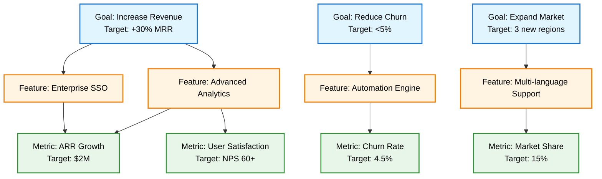
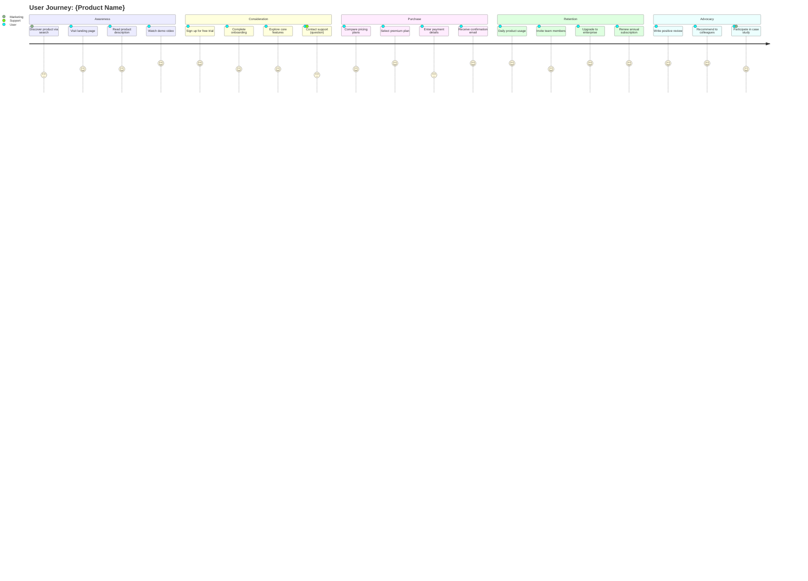
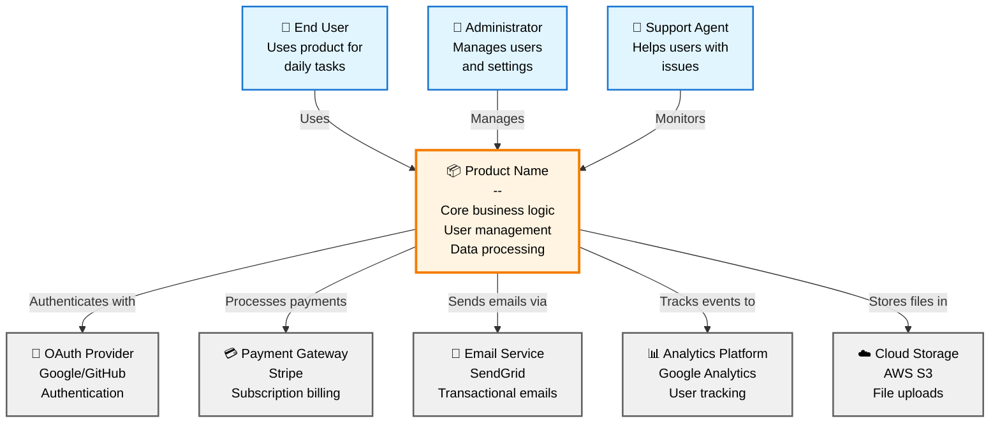
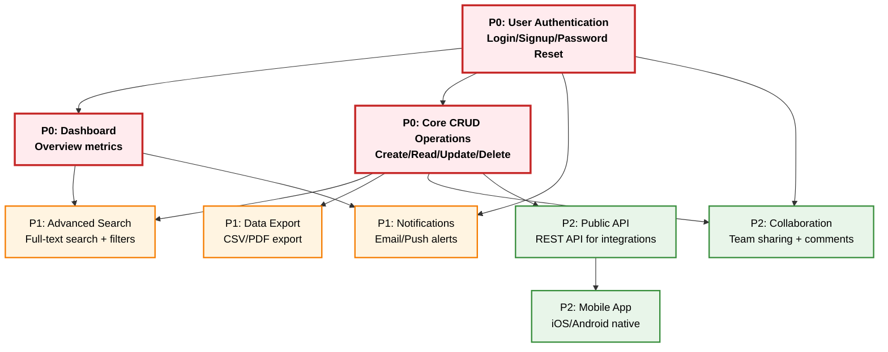
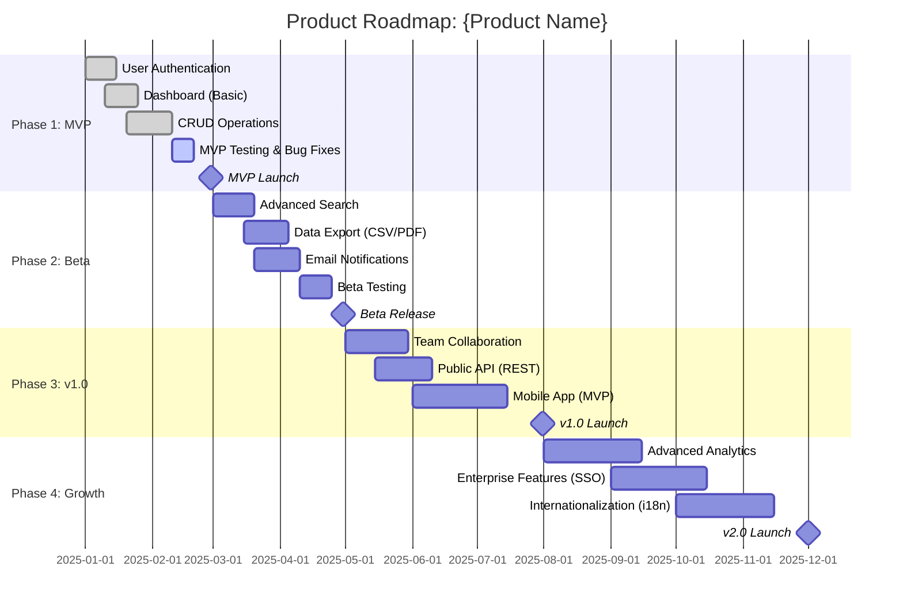
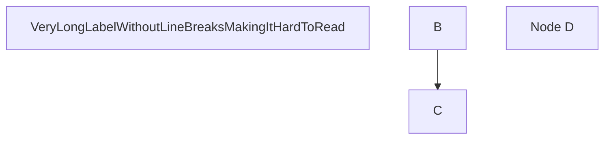
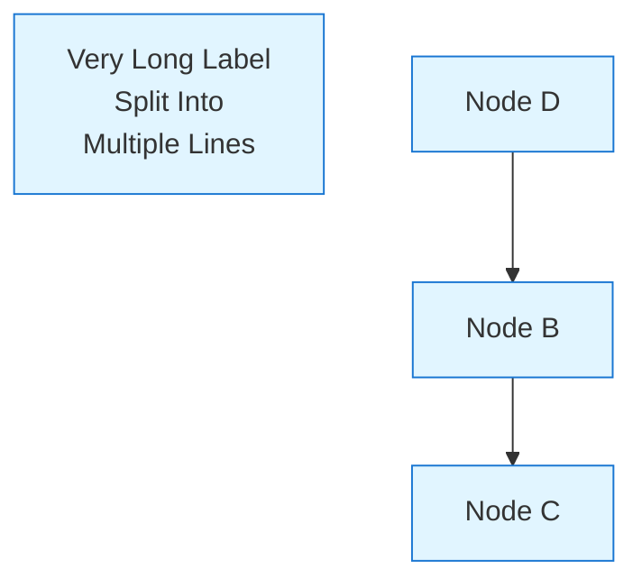

# Mermaid Diagram Templates for PRD

Этот документ содержит 5 стандартных шаблонов Mermaid диаграмм для Product Requirements Document (PRD).

## Overview

**Mermaid** - это язык диаграмм на основе текста, поддерживаемый GitHub, GitLab, VS Code и другими платформами.

**5 диаграмм для PRD:**
1. **Product Vision** - связь целей, функций и метрик (graph TD)
2. **User Journey** - путь пользователя через продукт (journey)
3. **System Context** - актеры и внешние системы (graph TD, C4-style)
4. **Feature Dependencies** - зависимости между функциями (graph TD)
5. **Roadmap Timeline** - временная шкала разработки (gantt)

---

## 1. Product Vision Diagram (graph TD)

### 1.1 Purpose

Визуализирует связь между бизнес-целями, ключевыми функциями и метриками успеха.

### 1.2 Template



### 1.3 Best Practices

- **Goals (Layer 1)**: 2-5 ключевых бизнес-целей
- **Features (Layer 2)**: 3-8 основных функций
- **Metrics (Layer 3)**: 3-6 измеримых показателей
- **Labels**: Используйте `<br/>` для многострочных надписей
- **Connections**: Показывайте только прямые связи (избегайте спагетти)
- **Colors**: Синий (goals), Оранжевый (features), Зеленый (metrics)

### 1.4 Validation Rules

```bash
✅ 5-15 нод (оптимально 8-12)
✅ 3 четких слоя (Goals → Features → Metrics)
✅ Все ноды имеют цветовую схему (classDef)
✅ Labels короткие (<50 символов на строку)
❌ Избегайте циклических связей
❌ Избегайте пересекающихся линий
```

---

## 2. User Journey Diagram (journey)

### 2.1 Purpose

Показывает эмоциональный опыт пользователя на разных этапах взаимодействия с продуктом.

### 2.2 Template



### 2.3 Best Practices

- **Sections**: 4-6 этапов (Awareness → Consideration → Purchase → Retention → Advocacy)
- **Activities**: 3-5 действий на этап
- **Scores**: 1-5 (1 = очень плохо, 5 = отлично)
- **Actors**: User, Marketing, Support, Product, etc.
- **Pain Points**: Низкие scores (1-2) показывают проблемы
- **Highlights**: Высокие scores (4-5) - удачные моменты

### 2.4 Validation Rules

```bash
✅ 4-6 секций (lifecycle stages)
✅ 15-25 активностей (total)
✅ Scores в диапазоне 1-5
✅ Минимум 2 актера (User + другие)
❌ Избегайте слишком детализированных действий
❌ Избегайте пропусков в lifecycle
```

---

## 3. System Context Diagram (graph TD, C4-style)

### 3.1 Purpose

C4-уровень контекста: показывает актеров (люди) и внешние системы, взаимодействующие с продуктом.

### 3.2 Template



### 3.3 Best Practices

- **Actors**: 2-5 типов пользователей (с emoji 👤)
- **System**: ВСЕГДА один центральный узел (ваш продукт)
- **External Systems**: 3-8 внешних сервисов (с emoji 🔐💳📧)
- **Labels**: Многострочные (`<br/>`) с описанием роли
- **Connections**: Направленные стрелки с глаголами
- **Colors**: Синий (actors), Оранжевый (system), Серый (external)

### 3.4 Validation Rules

```bash
✅ 1 центральный узел (SYSTEM)
✅ 2-5 актеров (people)
✅ 3-8 внешних систем
✅ Все стрелки направлены (-->)
✅ Labels с глаголами ("Uses", "Manages", "Sends")
❌ Избегайте прямых связей между актерами
❌ Избегайте прямых связей между внешними системами
```

---

## 4. Feature Dependencies Diagram (graph TD)

### 4.1 Purpose

Показывает зависимости между функциями и их приоритет (P0 = Must Have, P1 = Should Have, P2 = Could Have).

### 4.2 Template



### 4.3 Best Practices

- **P0 (Red)**: 3-5 критичных функций для MVP
- **P1 (Orange)**: 3-6 важных функций для полноценного продукта
- **P2 (Green)**: 2-5 "приятных дополнений"
- **Labels**: Приоритет + название + короткое описание
- **Dependencies**: Стрелки от зависимости к зависимому (P0 → P1 → P2)
- **Layout**: P0 сверху, P1 в центре, P2 снизу (top-down flow)

### 4.4 Validation Rules

```bash
✅ 8-16 функций (total)
✅ P0: 3-5 критичных функций
✅ Все P1 зависят от P0
✅ Все P2 зависят от P0 или P1
✅ Цветовая схема: Red (P0), Orange (P1), Green (P2)
❌ Избегайте циклических зависимостей
❌ P2 не должны блокировать P0/P1
```

---

## 5. Roadmap Timeline Diagram (gantt)

### 5.1 Purpose

Временная шкала разработки с фазами, функциями и вехами (milestones).

### 5.2 Template



### 5.3 Best Practices

- **Phases**: 3-5 фаз (MVP → Beta → v1.0 → Growth)
- **Features**: 3-6 функций на фазу
- **Milestones**: Ключевые события (launches, releases)
- **Status**: `done` (завершено), `active` (в процессе), пусто (запланировано)
- **Dependencies**: Implicit (последовательность в gantt)
- **Duration**: Реалистичные сроки (недели/месяцы, не дни)

### 5.4 Validation Rules

```bash
✅ 3-5 секций (phases)
✅ 12-25 задач (total)
✅ 3-5 milestones (key events)
✅ Даты в формате YYYY-MM-DD
✅ Последовательность фаз (no overlap of phases)
❌ Избегайте слишком коротких задач (<1 week)
❌ Избегайте overlap между критичными функциями
```

---

## 6. Color Scheme Standards

### 6.1 Unified Palette

Используйте эту палитру для всех диаграмм:

```css
/* Primary Colors */
Blue:   #1976d2  /* Goals, Actors, High Priority */
Orange: #f57c00  /* Features, System, Medium Priority */
Green:  #388e3c  /* Metrics, External, Low Priority */
Red:    #c62828  /* P0/Critical, Risks */
Gray:   #616161  /* External Systems, Inactive */

/* Background Colors (Light) */
Light Blue:   #e1f5ff
Light Orange: #fff4e1
Light Green:  #e8f5e9
Light Red:    #ffebee
Light Gray:   #f0f0f0
```

### 6.2 ClassDef Syntax

```mermaid
classDef styleName fill:#e1f5ff,stroke:#1976d2,stroke-width:2px,color:#000

class NODE1,NODE2 styleName
```

---

## 7. Common Syntax Patterns

### 7.1 Node Definitions

```mermaid
NODE_ID[Label Text]                  %% Rectangle
NODE_ID(Rounded Rectangle)           %% Rounded
NODE_ID([Stadium])                   %% Stadium-shaped
NODE_ID[[Subroutine]]                %% Double-border
NODE_ID{Diamond}                     %% Decision
NODE_ID{{Hexagon}}                   %% Hexagon
```

### 7.2 Edge Definitions

```mermaid
A --> B          %% Arrow
A --- B          %% Line (no arrow)
A -.-> B         %% Dotted arrow
A ==> B          %% Thick arrow
A -->|Label| B   %% Labeled arrow
```

### 7.3 Multiline Labels

```mermaid
NODE[Line 1<br/>Line 2<br/>Line 3]

NODE[Feature: Auth<br/>--<br/>Login/Signup]
```

### 7.4 Comments

```mermaid
%% This is a comment
graph TD
    A[Node A]  %% Inline comment
```

---

## 8. Validation Checklist

Перед финализацией диаграмм проверьте:

### 8.1 Syntax Validation
- [ ] Все ноды имеют уникальные ID
- [ ] Все связи используют валидные ID
- [ ] Multiline labels используют `<br/>`
- [ ] Comments начинаются с `%%`

### 8.2 Visual Quality
- [ ] Цветовая схема применена (classDef)
- [ ] Количество нод оптимально (5-15 для graph, 15-25 для journey)
- [ ] Labels читаемы (<50 символов на строку)
- [ ] Нет пересекающихся линий (насколько возможно)

### 8.3 Content Quality
- [ ] Диаграмма отражает реальные требования (не placeholder)
- [ ] Все термины согласованы с глоссарием
- [ ] Зависимости логичны (нет циклов в feature dependencies)
- [ ] Даты реалистичны (gantt)

### 8.4 Integration
- [ ] Диаграммы встроены в соответствующие PRD разделы
- [ ] README.md содержит ссылки на все диаграммы
- [ ] Файлы названы правильно (`product-vision.mmd`, etc.)

---

## 9. Common Mistakes

### ❌ Плохо


### ✅ Хорошо


---

## 10. Rendering Tools

Mermaid поддерживается в:
- ✅ GitHub/GitLab (native rendering)
- ✅ VS Code (Mermaid Preview extension)
- ✅ Obsidian, Notion
- ✅ Mermaid Live Editor (https://mermaid.live)

**Testing**: Всегда проверяйте диаграммы в [Mermaid Live Editor](https://mermaid.live) перед коммитом.

---

## Summary

Эти 5 шаблонов покрывают все ключевые визуализации для PRD:
1. **Product Vision** - стратегия (Goals → Features → Metrics)
2. **User Journey** - UX опыт (Awareness → Advocacy)
3. **System Context** - архитектура (Actors + System + External)
4. **Feature Dependencies** - планирование (P0 → P1 → P2)
5. **Roadmap Timeline** - выполнение (Phases + Milestones)

Используйте эти шаблоны в Phase 5 (Mermaid Diagram Generation) для автоматической генерации диаграмм на основе собранных требований.
