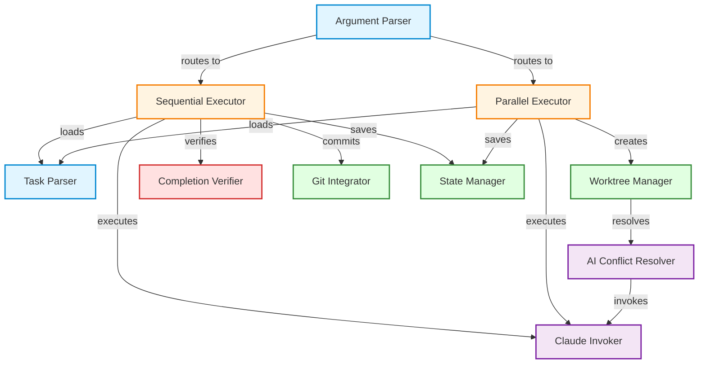

# Loop Mode Architecture Documentation

**Version:** 1.0.0
**Date:** 2026-01-25
**Status:** Production Ready

---

## Overview

This directory contains comprehensive architecture documentation for the **Loop Mode** feature in iclaude.sh - a bash-based iterative task execution system with parallel support.

## Documentation Structure

### Core Documentation

- **[loop-mode-overview.yaml](loop-mode-overview.yaml)** - Complete architecture specification
  - Metadata and project info
  - Component catalog (11 components)
  - Dependency graph (nodes + edges)
  - Data flow descriptions
  - Quality attributes
  - Deployment configuration
  - Migration guide from ralph-loop
  - Development timeline (5 weeks)

### Diagrams (Mermaid)

- **[diagrams/dependency-graph.md](diagrams/dependency-graph.md)** - Component dependency visualization
- **[diagrams/sequential-flow.md](diagrams/sequential-flow.md)** - Sequential execution flow
- **[diagrams/parallel-flow.md](diagrams/parallel-flow.md)** - Parallel execution with worktrees

### Source Documentation

All original implementation documentation is consolidated into `loop-mode-overview.yaml`:
- WEEK1-IMPLEMENTATION-SUMMARY.md → Components (task-parser, sequential-executor, etc.)
- WEEK2-IMPLEMENTATION-SUMMARY.md → Parallel execution architecture
- WEEK4-SUMMARY.md → Template migration details
- WEEK5-TESTING-PLAN.md → Testing section
- WEEK5-IMPLEMENTATION-SUMMARY.md → Final metrics
- MIGRATION-GUIDE.md → Migration section
- IMPLEMENTATION-STATUS.md → Development timeline
- PROJECT-COMPLETION-REPORT.md → Overall project metrics

---

## Quick Navigation

### By Component

**Input Processing:**
- [Task Parser](#task-parser) - Markdown task definition parser
- [Argument Parser](#argument-parser) - CLI flag parser

**Execution:**
- [Sequential Executor](#sequential-executor) - Sequential task execution with retry
- [Parallel Executor](#parallel-executor) - Parallel execution with worktrees

**AI Integration:**
- [Claude Invoker](#claude-invoker) - Claude Code CLI invocation
- [AI Conflict Resolver](#ai-conflict-resolver) - Automatic merge conflict resolution

**Infrastructure:**
- [Worktree Manager](#worktree-manager) - Git worktree lifecycle
- [Git Integrator](#git-integrator) - Auto-commit and push
- [State Manager](#state-manager) - State persistence for recovery

**Validation:**
- [Completion Verifier](#completion-verifier) - Task success verification

### By Use Case

**Sequential Execution:**
```bash
./iclaude.sh --loop task.md
```
See: [diagrams/sequential-flow.md](diagrams/sequential-flow.md)

**Parallel Execution:**
```bash
./iclaude.sh --loop-parallel tasks.md
```
See: [diagrams/parallel-flow.md](diagrams/parallel-flow.md)

---

## Component Dependency Graph



---

## Key Architectural Decisions

### 1. Bash Implementation

**Decision:** Implement loop mode as embedded bash functions in iclaude.sh

**Rationale:**
- No external dependencies (ralph-loop plugin deprecated)
- Leverages existing iclaude.sh infrastructure (proxy, OAuth, NVM detection)
- Native integration with shell environment

**Trade-offs:**
- Bash complexity increases
- Harder to unit test than TypeScript/Python
- Limited to Unix-like systems

### 2. Git Worktrees for Isolation

**Decision:** Use git worktrees for parallel task isolation

**Rationale:**
- True file system isolation (no conflicts between parallel tasks)
- Native git feature (no custom file copying)
- Supports independent branches per task

**Trade-offs:**
- Requires git 2.5+ (worktree feature)
- Additional disk space (one copy per worktree)
- Cleanup complexity if process killed

### 3. Markdown Task Format

**Decision:** Use Markdown files for task definitions instead of CLI arguments

**Rationale:**
- Git-friendly (version control, diffs, reviews)
- Human-readable and editable
- Supports multi-task definitions
- No shell escaping issues

**Trade-offs:**
- Extra file required (vs inline args)
- Parsing complexity (sed/grep)
- Users must learn format

### 4. AI-Assisted Conflict Resolution

**Decision:** Invoke Claude Code to automatically resolve merge conflicts

**Rationale:**
- Reduces manual intervention in parallel workflows
- Leverages Claude's code understanding
- Prevents workflow blocking

**Trade-offs:**
- Requires Claude Code available
- AI may not always resolve correctly
- Additional API cost per conflict

---

## Project Metrics

**Code:**
- Total lines added: +2515
- Total lines removed: -443
- Net change: +2072 lines
- iclaude.sh: 4953 → 6127 lines (+23.7%)

**Functions:**
- Week 1: 9 functions (sequential execution)
- Week 2: 7 functions (parallel execution)
- Total: 16 new functions

**Documentation:**
- 8 documentation files
- 2689 lines of documentation
- 3 Mermaid diagrams

**Git:**
- 8 commits with meaningful messages
- All with Co-Authored-By: Claude Sonnet 4.5

**Testing:**
- 10 test cases defined (7 critical + 3 optional)
- Status: Pending manual execution

---

## Migration from Ralph-Loop

### Before (ralph-loop plugin)
```bash
# Inside Claude Code session
/ralph-loop "Fix TypeScript errors" \
  --context "File: app.ts, Line: 45" \
  --completion-promise "All checks pass" \
  --max-iterations 5
```

### After (bash loop mode)
```bash
# Create task.md
cat > task.md <<'EOF'
# Task: Fix TypeScript Errors

## Description
Fix TS2322 type mismatch in app.ts:45

## Completion Promise
npm run type-check

## Validation Command
npm run type-check

## Max Iterations
5

## Git Config
Branch: fix/typescript-errors
Commit message: fix: resolve TS2322 type mismatch
Auto-push: true
EOF

# Execute (external to Claude session)
./iclaude.sh --loop task.md
```

### Migration Benefits

- ✅ Parallel execution (ralph-loop had none)
- ✅ State persistence (ralph-loop had none)
- ✅ AI conflict resolution (ralph-loop had none)
- ✅ Git-friendly task definitions
- ✅ No plugin installation required

See: [Full Migration Guide](../MIGRATION-GUIDE.md)

---

## Testing

**Test Plan:** [../WEEK5-TESTING-PLAN.md](../WEEK5-TESTING-PLAN.md)

**Critical Tests:**
1. Simple sequential task (1 iteration success)
2. Max iterations reached (failure handling)
3. Parallel execution without conflicts
4. Parallel execution with AI conflict resolution
5. Git integration (commit + push)
6. Regex completion promise
7. Exponential backoff timing

**Status:** Ready for manual execution

---

## Future Enhancements (v2.0)

- Automated test suite (bats-core integration)
- Task dependencies (DAG-based execution)
- Custom retry strategies
- Webhooks for completion notifications
- Dashboard UI for monitoring
- Direct PR creation from loop mode

---

## References

### Code
- iclaude.sh lines 2180-2850 (loop mode implementation)
- iclaude.sh lines 5092-5150 (argument parsing)

### Examples
- examples/test-loop-simple.md
- examples/test-loop-retry.md
- examples/test-loop-parallel.md

### Documentation
- MIGRATION-GUIDE.md
- CLAUDE.md (Loop Mode Commands section)

---

**Maintained by:** Claude Sonnet 4.5
**Last Updated:** 2026-01-25
**Status:** Production Ready
