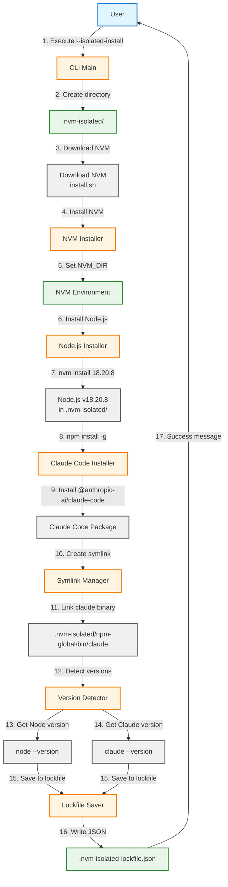
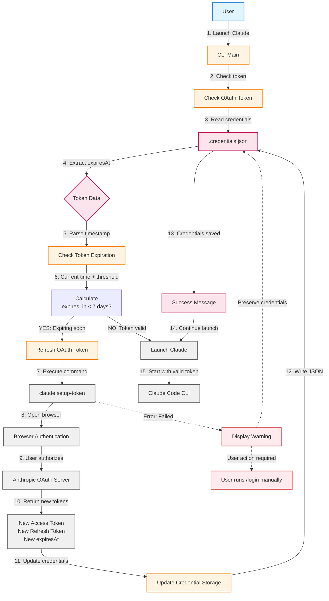

# iclaude Architecture Documentation

> Comprehensive architecture documentation for the iclaude project - a bash-based wrapper for Claude Code with proxy configuration and isolated environment management.

## Table of Contents

- [Overview](#overview)
- [Architecture Style](#architecture-style)
- [Layers](#layers)
- [Component Dependency Graph](#component-dependency-graph)
- [Data Flow Diagrams](#data-flow-diagrams)
  - [Proxy Configuration Flow](#proxy-configuration-flow)
  - [Isolated Installation Flow](#isolated-installation-flow)
  - [OAuth Token Refresh Flow](#oauth-token-refresh-flow)
  - [Router Launch Flow](#router-launch-flow)
- [Key Components](#key-components)
- [Security Considerations](#security-considerations)
- [Deployment](#deployment)
- [Skills Integration](#skills-integration)

---

## Overview

**iclaude** is a modular bash script (3796 lines) that provides:
- Automatic HTTP/HTTPS proxy configuration
- Isolated portable environment management (.nvm-isolated/)
- Version locking via lockfile
- OAuth token auto-refresh
- Claude Code Router integration for alternative LLM providers

### Metrics

- **Total Components**: 48
- **Total Dependencies**: 43
- **Max Dependency Depth**: 5
- **Lines of Code**: ~3900
- **Complexity**: Medium

---

## Architecture Style

**Pattern**: Modular Layered Architecture

The project follows a **layered architecture** with clear separation of concerns:

1. **CLI Layer** - User interaction and command routing
2. **Core Layer** - Business logic modules
3. **Installation Layer** - NVM/Node.js/Claude/Router installation
4. **Infrastructure Layer** - Low-level utilities and system interaction

---

## Layers

### 1. CLI Layer
- **Responsibilities**: Argument parsing, command routing, user feedback
- **Components**: `cli-main`, `cli-usage`

### 2. Core Layer
- **Responsibilities**: Proxy configuration, environment management, version control, OAuth, Router
- **Modules**:
  - Proxy Management (validation, credentials, testing)
  - Isolated Environment (setup, repair, status)
  - Version Management (lockfile save/restore)
  - Configuration Management (isolated/shared config)
  - OAuth Token Management (auto-refresh)
  - Router Management (detection, status)

### 3. Installation Layer
- **Responsibilities**: Install and manage NVM, Node.js, Claude Code, Router
- **Components**: Installers, updaters, symlink managers, path finders

### 4. Infrastructure Layer
- **Responsibilities**: File I/O, credential storage, git config, dependency validation
- **Components**: Credential storage, git proxy config, output formatters, validators

---

## Component Dependency Graph

The following diagram shows the dependency relationships between all major components:

```mermaid
graph TD
    %% CLI Layer
    CLI[cli-main<br/>Main Entry Point]
    USAGE[cli-usage<br/>Usage Display]

    %% Core Layer - Proxy Management
    PROXY[proxy-management<br/>Proxy Management]
    VALIDATE[validate-proxy-url<br/>URL Validator]
    RESOLVE[resolve-domain<br/>Domain Resolution]
    PARSE[parse-proxy-url<br/>URL Parser]
    CONFIG_PROXY[configure-proxy<br/>Environment Configurator]
    TEST_PROXY[test-proxy<br/>Connection Tester]

    %% Core Layer - Environment Management
    ISOLATED[isolated-environment<br/>Environment Manager]
    SETUP_NVM[setup-isolated-nvm<br/>NVM Setup]
    REPAIR[repair-isolated-env<br/>Environment Repair]
    CHECK_STATUS[check-isolated-status<br/>Status Checker]

    %% Core Layer - Version Management
    VERSION_MGT[version-management<br/>Version Manager]
    SAVE_LOCK[save-lockfile<br/>Lockfile Saver]
    INSTALL_LOCK[install-from-lockfile<br/>Lockfile Installer]

    %% Core Layer - Configuration Management
    CONFIG_MGT[config-management<br/>Config Manager]
    SETUP_CONFIG[setup-isolated-config<br/>Config Setup]
    EXPORT_IMPORT[export-import-config<br/>Config Migration]

    %% Core Layer - OAuth Token Management
    OAUTH[oauth-token-management<br/>Token Manager]
    CHECK_TOKEN[check-oauth-token<br/>Token Checker]
    REFRESH_TOKEN[refresh-oauth-token<br/>Token Refresher]
    CHECK_EXP[check-token-expiration<br/>Expiration Checker]

    %% Core Layer - Router Management
    ROUTER[router-management<br/>Router Manager]
    DETECT_ROUTER[detect-router<br/>Router Detector]
    GET_ROUTER[get-router-path<br/>Router Path Finder]
    CHECK_ROUTER[check-router-status<br/>Router Status]

    %% Installation Layer
    NVM_INST[nvm-installer<br/>NVM Installer]
    NODE_INST[nodejs-installer<br/>Node.js Installer]
    CLAUDE_INST[claude-installer<br/>Claude Installer]
    ROUTER_INST[router-installer<br/>Router Installer]
    UPDATER[claude-updater<br/>Claude Updater]
    CLEANUP[cleanup-old-installations<br/>Installation Cleaner]
    SYMLINK[symlink-manager<br/>Symlink Manager]
    NVM_DETECT[nvm-detector<br/>NVM Detector]
    CLAUDE_PATH[claude-path-finder<br/>Claude Path Finder]
    VERSION_DETECT[version-detector<br/>Version Detector]

    %% Infrastructure Layer
    CRED_STORE[credential-storage<br/>Credential Storage]
    GIT_PROXY[git-proxy-config<br/>Git Proxy Config]
    FILE_OPS[file-operations<br/>File Operations]
    JQ_VALID[jq-validator<br/>JQ Validator]
    DEP_CHECK[dependency-checker<br/>Dependency Checker]
    OUTPUT[output-formatters<br/>Output Formatters]

    %% External Dependencies
    CLAUDE_CLI[claude-cli<br/>Claude Code CLI]
    ROUTER_CLI[router-cli<br/>Router CLI]
    NVM_BIN[nvm-binary<br/>NVM Binary]
    GIT_BIN[git-binary<br/>Git Binary]
    CURL_BIN[curl-binary<br/>Curl Binary]
    JQ_BIN[jq-binary<br/>JQ Binary]

    %% Dependencies - CLI Layer
    CLI -->|routes to| PROXY
    CLI -->|routes to| ISOLATED
    CLI -->|routes to| VERSION_MGT
    CLI -.->|optional| OAUTH
    CLI -.->|optional| ROUTER

    %% Dependencies - Proxy Management
    PROXY --> VALIDATE
    PROXY -.-> RESOLVE
    PROXY --> CRED_STORE
    PROXY -.-> GIT_PROXY
    VALIDATE --> PARSE
    CONFIG_PROXY --> PARSE
    TEST_PROXY --> CONFIG_PROXY
    TEST_PROXY --> CURL_BIN

    %% Dependencies - Environment Management
    ISOLATED --> NVM_INST
    ISOLATED --> NODE_INST
    ISOLATED --> CLAUDE_INST
    ISOLATED --> VERSION_MGT
    ISOLATED --> SETUP_NVM
    ISOLATED --> REPAIR

    %% Dependencies - Version Management
    VERSION_MGT --> SAVE_LOCK
    VERSION_MGT --> INSTALL_LOCK
    SAVE_LOCK --> VERSION_DETECT
    INSTALL_LOCK --> NVM_INST
    INSTALL_LOCK --> NODE_INST
    INSTALL_LOCK --> CLAUDE_INST
    INSTALL_LOCK -.-> ROUTER_INST

    %% Dependencies - OAuth Management
    OAUTH --> CHECK_TOKEN
    CHECK_TOKEN --> CHECK_EXP
    CHECK_TOKEN -.-> REFRESH_TOKEN
    REFRESH_TOKEN --> CLAUDE_CLI
    OAUTH --> CRED_STORE
    OAUTH --> JQ_VALID

    %% Dependencies - Router Management
    ROUTER --> DETECT_ROUTER
    ROUTER --> GET_ROUTER
    ROUTER -.-> ROUTER_INST
    DETECT_ROUTER --> GET_ROUTER
    CHECK_ROUTER --> JQ_VALID

    %% Dependencies - Installation Layer
    CLAUDE_INST --> NODE_INST
    CLAUDE_INST --> SYMLINK
    ROUTER_INST --> NODE_INST
    ROUTER_INST --> SYMLINK
    NODE_INST --> NVM_INST
    UPDATER --> CLEANUP
    UPDATER --> SYMLINK
    UPDATER --> SAVE_LOCK
    CLAUDE_PATH --> NVM_DETECT
    VERSION_DETECT --> CLAUDE_PATH

    %% Dependencies - Infrastructure
    GIT_PROXY --> GIT_BIN
    CONFIG_MGT --> FILE_OPS

    %% Layer Styling
    classDef cliLayer fill:#e1f5ff,stroke:#1976d2,stroke-width:2px
    classDef coreLayer fill:#fff4e1,stroke:#f57c00,stroke-width:2px
    classDef installLayer fill:#e8f5e9,stroke:#388e3c,stroke-width:2px
    classDef infraLayer fill:#fce4ec,stroke:#c2185b,stroke-width:2px
    classDef externalLayer fill:#f0f0f0,stroke:#616161,stroke-width:2px

    class CLI,USAGE cliLayer
    class PROXY,VALIDATE,RESOLVE,PARSE,CONFIG_PROXY,TEST_PROXY,ISOLATED,SETUP_NVM,REPAIR,CHECK_STATUS,VERSION_MGT,SAVE_LOCK,INSTALL_LOCK,CONFIG_MGT,SETUP_CONFIG,EXPORT_IMPORT,OAUTH,CHECK_TOKEN,REFRESH_TOKEN,CHECK_EXP,ROUTER,DETECT_ROUTER,GET_ROUTER,CHECK_ROUTER coreLayer
    class NVM_INST,NODE_INST,CLAUDE_INST,ROUTER_INST,UPDATER,CLEANUP,SYMLINK,NVM_DETECT,CLAUDE_PATH,VERSION_DETECT installLayer
    class CRED_STORE,GIT_PROXY,FILE_OPS,JQ_VALID,DEP_CHECK,OUTPUT infraLayer
    class CLAUDE_CLI,ROUTER_CLI,NVM_BIN,GIT_BIN,CURL_BIN,JQ_BIN externalLayer
```



**Legend**:
- **Blue (CLI Layer)**: User interaction components
- **Yellow (Core Layer)**: Business logic modules
- **Green (Installation Layer)**: Installation and update components
- **Pink (Infrastructure Layer)**: Low-level utilities
- **Gray (External Layer)**: External dependencies
- **Solid lines**: Required dependencies
- **Dashed lines**: Optional dependencies

---

## Data Flow Diagrams

### Proxy Configuration Flow

This flow shows how a user configures proxy settings, which are validated, stored, and used to launch Claude Code.

```mermaid
graph LR
    %% Proxy Configuration Flow
    USER[User] -->|1. Provides proxy URL| CLI[CLI Main]
    CLI -->|2. Validate format| VALIDATE[Validate Proxy URL]
    VALIDATE -->|3. Check protocol| PROTOCOL{Protocol?}

    PROTOCOL -->|HTTP| RESOLVE[Resolve Domain<br/>to IP]
    PROTOCOL -->|HTTPS| PARSE[Parse Proxy URL]
    RESOLVE -->|4. Convert domain| PARSE

    PARSE -->|5. Extract credentials| CRED[Credential Storage]
    CRED -->|6. Save credentials<br/>chmod 600| FILE[.claude_proxy_credentials]

    FILE -->|7. Load credentials| CONFIG[Configure Proxy]
    CONFIG -->|8. Set environment<br/>variables| ENV[HTTPS_PROXY<br/>HTTP_PROXY<br/>NO_PROXY]

    ENV -->|9. Test connectivity| TEST[Test Proxy]
    TEST -->|10. HTTP request| HTTP_TEST[http://www.google.com]
    TEST -->|11. HTTPS request| HTTPS_TEST[https://www.anthropic.com]

    HTTP_TEST -->|12. Success| LAUNCH[Launch Claude]
    HTTPS_TEST -->|12. Success| LAUNCH

    LAUNCH -->|13. Start with proxy| CLAUDE[Claude Code CLI]

    %% Styling
    classDef userClass fill:#e1f5ff,stroke:#1976d2,stroke-width:2px
    classDef processClass fill:#fff4e1,stroke:#f57c00,stroke-width:2px
    classDef storageClass fill:#fce4ec,stroke:#c2185b,stroke-width:2px
    classDef externalClass fill:#f0f0f0,stroke:#616161,stroke-width:2px

    class USER userClass
    class CLI,VALIDATE,RESOLVE,PARSE,CONFIG,TEST processClass
    class CRED,FILE,ENV storageClass
    class HTTP_TEST,HTTPS_TEST,CLAUDE externalClass
```



**Key Steps**:
1. User provides proxy URL via command-line
2. URL validated (HTTP/HTTPS only, SOCKS5 not supported)
3. For HTTPS: domain preserved; for HTTP: optional IP conversion
4. Credentials extracted and saved with chmod 600
5. Environment variables configured
6. Connectivity tested against google.com and anthropic.com
7. Claude Code launched with proxy settings

---

### Isolated Installation Flow

This flow demonstrates the installation of a complete isolated environment with version locking.



**Key Steps**:
1. User executes `./iclaude.sh --isolated-install`
2. .nvm-isolated/ directory created
3. NVM downloaded and installed
4. Node.js 18.20.8 installed via NVM
5. Claude Code installed globally via npm
6. Symlinks created for binaries (npm, npx, claude)
7. Versions detected and saved to lockfile
8. Installation complete (~278MB portable environment)

---

### OAuth Token Refresh Flow

This flow shows automatic OAuth token validation and refresh to prevent manual `/login` prompts.



**Key Steps**:
1. User launches Claude Code
2. Token expiration checked at every launch
3. If token expires within 7 days (configurable), automatic refresh triggered
4. `claude setup-token` executed (opens browser for OAuth)
5. User authorizes, receives long-lived token (~1 year)
6. Credentials updated in .credentials.json
7. Launch continues with valid token

**Error Handling**:
- If refresh fails, credentials preserved (doesn't delete refreshToken)
- Warning displayed, user directed to run `/login` manually

---

### Router Launch Flow

This flow demonstrates how the Router integration works for using alternative LLM providers.

```mermaid
graph LR
    %% Router Launch Flow
    USER[User] -->|1. Launch with --router flag| CLI[CLI Main]
    CLI -->|2. Check router availability| DETECT[Detect Router]

    DETECT -->|3. Check config exists| CONFIG_CHECK{router.json<br/>exists?}
    DETECT -->|4. Check binary exists| BIN_CHECK{ccr binary<br/>exists?}

    CONFIG_CHECK -->|NO| ERROR[Error: Router not installed]
    BIN_CHECK -->|NO| ERROR

    CONFIG_CHECK -->|YES| COPY[Copy Config]
    BIN_CHECK -->|YES| COPY

    COPY -->|5. Copy router.json| DEST[~/.claude-code-router/config.json]
    DEST -->|6. Read config| ROUTER_CONFIG[Router Configuration<br/>providers, models, API keys]

    ROUTER_CONFIG -->|7. Load proxy settings| PROXY[Configure Proxy<br/>Environment Variables]
    PROXY -->|8. Set HTTPS_PROXY| ENV[Environment<br/>HTTPS_PROXY<br/>HTTP_PROXY]

    ENV -->|9. Launch router| ROUTER_CLI[ccr code]
    ROUTER_CLI -->|10. Start router service| ROUTER_SERVICE[Claude Code Router Service]

    ROUTER_SERVICE -->|11. Intercept API calls| INTERCEPT[API Call Interceptor]
    INTERCEPT -->|12. Route to provider| PROVIDER{Configured<br/>Provider}

    PROVIDER -->|DeepSeek| DEEPSEEK[DeepSeek API]
    PROVIDER -->|OpenRouter| OPENROUTER[OpenRouter API]
    PROVIDER -->|Ollama| OLLAMA[Ollama Local]
    PROVIDER -->|Gemini| GEMINI[Google Gemini API]
    PROVIDER -->|Claude| ANTHROPIC[Anthropic API<br/>via proxy]

    DEEPSEEK -->|Response| RESPONSE[Format Response]
    OPENROUTER -->|Response| RESPONSE
    OLLAMA -->|Response| RESPONSE
    GEMINI -->|Response| RESPONSE
    ANTHROPIC -->|Response| RESPONSE

    RESPONSE -->|13. Return to client| CLAUDE[Claude Code CLI]
    CLAUDE -->|14. Display to user| USER

    %% Styling
    classDef userClass fill:#e1f5ff,stroke:#1976d2,stroke-width:2px
    classDef processClass fill:#fff4e1,stroke:#f57c00,stroke-width:2px
    classDef storageClass fill:#e8f5e9,stroke:#388e3c,stroke-width:2px
    classDef providerClass fill:#f3e5f5,stroke:#7b1fa2,stroke-width:2px
    classDef errorClass fill:#ffebee,stroke:#d32f2f,stroke-width:2px

    class USER userClass
    class CLI,DETECT,COPY,PROXY,INTERCEPT,RESPONSE processClass
    class DEST,ROUTER_CONFIG,ENV storageClass
    class ROUTER_CLI,ROUTER_SERVICE,DEEPSEEK,OPENROUTER,OLLAMA,GEMINI,ANTHROPIC,CLAUDE providerClass
    class ERROR errorClass
```



**Key Steps**:
1. User launches with `./iclaude.sh --router`
2. Router availability checked (router.json + ccr binary)
3. Configuration copied to ~/.claude-code-router/config.json
4. Proxy environment variables inherited by router
5. `ccr code` launched instead of `claude`
6. Router intercepts API calls and routes to configured provider
7. Responses formatted and returned to Claude Code CLI

**Supported Providers**:
- OpenRouter (aggregator)
- DeepSeek
- OpenAI
- Ollama (local)
- Google Gemini
- Volcengine
- SiliconFlow

**Note**: Router is opt-in via `--router` flag. Default behavior (without flag) launches native Claude directly.

---

## Key Components

### Proxy Management Module

**Location**: iclaude.sh:60-2015
**Purpose**: Validate proxy URLs, store credentials, configure environment, test connectivity

**Functions**:
- `validate_proxy_url()` - Validates URL format (HTTP/HTTPS only)
- `resolve_domain_to_ip()` - Resolves domains to IPs (HTTP only)
- `parse_proxy_url()` - Extracts credentials and host
- `save_credentials()` - Saves to `.claude_proxy_credentials` (chmod 600)
- `load_credentials()` - Loads saved credentials
- `configure_proxy_from_url()` - Sets HTTPS_PROXY, HTTP_PROXY, NO_PROXY
- `test_proxy()` - Tests connectivity via curl

**Protocols**:
- **HTTPS** (recommended): Preserves domain names for OAuth/TLS
- **HTTP**: Optional domain-to-IP conversion
- **SOCKS5**: NOT supported (causes crash due to undici library)

---

### Isolated Environment Module

**Location**: iclaude.sh:422-1121
**Purpose**: Manage portable NVM+Node.js+Claude installation

**Functions**:
- `setup_isolated_nvm()` - Configures NVM_DIR and PATH
- `install_isolated_nvm()` - Downloads and installs NVM
- `install_isolated_nodejs()` - Installs Node.js via NVM
- `install_isolated_claude()` - Installs Claude Code via npm
- `repair_isolated_environment()` - Fixes broken symlinks after git clone
- `check_isolated_status()` - Displays comprehensive status

**Directory Structure**:
```
.nvm-isolated/
├── nvm.sh                          # NVM installation script
├── versions/node/v18.20.8/         # Node.js installation
│   ├── bin/                        # Binaries (node, npm, npx)
│   └── lib/node_modules/           # Global npm packages
├── npm-global/bin/                 # Global binaries (claude, ccr)
└── .claude-isolated/               # Isolated Claude configuration
    ├── .credentials.json           # OAuth tokens
    ├── settings.json               # User settings
    ├── history.jsonl               # Command history
    └── skills/                     # Claude Code skills
```

---

### Version Management Module

**Location**: iclaude.sh:732-910
**Purpose**: Track and reproduce exact versions via lockfile

**Functions**:
- `save_isolated_lockfile()` - Captures current versions
- `install_from_lockfile()` - Installs exact versions
- `get_cli_version()` - Detects CLI version

**Lockfile Format** (`.nvm-isolated-lockfile.json`):
```json
{
  "nodeVersion": "18.20.8",
  "claudeCodeVersion": "2.0.76",
  "routerVersion": "not installed",
  "installedAt": "2026-01-07T16:24:22Z",
  "nvmVersion": "0.39.7"
}
```

---

### OAuth Token Management Module

**Location**: iclaude.sh:3021-3183
**Purpose**: Automatic token validation and refresh

**Functions**:
- `check_oauth_token()` - Validates token at launch
- `refresh_oauth_token()` - Refreshes via `claude setup-token`
- `check_token_expiration()` - Checks expiration threshold

**Configuration**:
- `TOKEN_REFRESH_THRESHOLD` = 604800 seconds (7 days)
- Refresh triggered if token expires within threshold
- Long-lived tokens (~1 year validity)

**Token Structure** (`.credentials.json`):
```json
{
  "claudeAiOauth": {
    "accessToken": "sk-ant-oat01-...",
    "refreshToken": "sk-ant-ort01-...",
    "expiresAt": 1766460813792,
    "scopes": ["user:inference", "user:profile", "user:sessions:claude_code"],
    "subscriptionType": "max"
  }
}
```

---

### Router Management Module

**Location**: iclaude.sh:333-1430
**Purpose**: Integrate Claude Code Router for alternative LLM providers

**Functions**:
- `detect_router()` - Checks availability (config + binary)
- `get_router_path()` - Locates ccr binary
- `install_isolated_router()` - Installs via npm
- `check_router_status()` - Displays configuration and status

**Configuration Files**:
- `router.json.example` - Template with all providers (committed)
- `router.json` - Team config with `${VAR}` placeholders (committed)
- `~/.claude-code-router/config.json` - Runtime config (NOT in git)

**Environment Variable Substitution**:
```json
{
  "providers": {
    "deepseek": {
      "apiKey": "${DEEPSEEK_API_KEY}"
    }
  }
}
```

---

## Security Considerations

### 1. Credential Storage
- **Risk**: Proxy credentials contain sensitive information
- **Mitigation**:
  - File permissions set to chmod 600 (owner-only)
  - `.claude_proxy_credentials` in .gitignore
  - Password display hidden by default (requires `--show-password`)

### 2. HTTPS Proxy MitM Vulnerability
- **Risk**: undici ProxyAgent doesn't verify TLS certificates ([HackerOne #1583680](https://hackerone.com/reports/1583680))
- **Mitigation**:
  - Only use trusted proxy servers
  - Prefer `--proxy-ca /path/to/cert.pem` over `--proxy-insecure`
  - Document risk in CLAUDE.md

### 3. OAuth Token Persistence
- **Risk**: Access tokens stored in plaintext .credentials.json
- **Mitigation**:
  - Automatic refresh within 7 days of expiration
  - Long-lived tokens reduce refresh frequency
  - Credentials file not committed to git

### 4. Git Exclusion
- **Risk**: Sensitive files accidentally committed
- **Mitigation**:
  - .gitignore entries for:
    - `.claude_proxy_credentials`
    - `.nvm-isolated/.claude-isolated/*` (except skills/ and CLAUDE.md)
    - `.nvm-isolated/.cache/`
    - `.nvm-isolated/.npm/`

---

## Deployment

### Installation Modes

#### Isolated (Recommended)
- **Location**: `.nvm-isolated/` directory
- **Size**: ~278MB
- **Portability**: Can be committed to git
- **Version Control**: Lockfile ensures reproducibility
- **Installation**: `./iclaude.sh --isolated-install`

#### System-Wide
- **Location**: System NVM (`$NVM_DIR`)
- **Shared**: Global Node.js installation
- **Installation**: `./iclaude.sh --install`

### Configuration Modes

#### Isolated Config (Default with isolated installation)
- **Location**: `.nvm-isolated/.claude-isolated/`
- **Isolation**: Separate history/sessions from system
- **Activation**: Automatic with isolated environment

#### Shared Config (Default with system installation)
- **Location**: `~/.claude/`
- **Shared**: Between all installations
- **Activation**: Default for system installation

### Proxy Support

| Protocol | Status | Domain Handling | Use Case |
|----------|--------|----------------|----------|
| HTTPS | ✅ Recommended | Preserved | OAuth/TLS compatibility |
| HTTP | ⚠️ Supported | Optional IP conversion | Legacy proxies |
| SOCKS5 | ❌ NOT Supported | N/A | Causes crash (undici limitation) |

**Workaround for SOCKS5**: Use Privoxy or Squid to convert SOCKS5 → HTTPS locally.

### Router Integration

- **Mode**: Opt-in via `--router` flag
- **Default**: Native Claude (without flag)
- **Installation**: `./iclaude.sh --install-router`
- **Providers**: OpenRouter, DeepSeek, Ollama, Gemini, OpenAI, Volcengine, SiliconFlow
- **Proxy Compatibility**: Router inherits HTTPS_PROXY/HTTP_PROXY environment variables

---

## Skills Integration

The project includes a Skills system for enhanced development workflows:

**Skills Directory**: `.nvm-isolated/.claude-isolated/skills/`

**Available Skills**:
- `structured-planning` - Break down tasks into phases
- `bash-development` - Refactor bash functions
- `git-workflow` - Commit message generation
- `validation-framework` - Test new features
- `context-awareness` - Detect project context
- `task-decomposition` - Decompose complex tasks
- `thinking-framework` - Structured reasoning
- `error-handling` - Structured error handling
- `rollback-recovery` - Rollback mechanisms
- `proxy-management` - Proxy configuration
- `isolated-environment` - Environment management
- `code-review` - Automated code review
- `approval-gates` - Plan approval
- `adaptive-workflow` - Adaptive complexity
- `phase-execution` - Execute single phase
- `architecture-documentation` - Generate architecture docs

**Usage**:
- Skills invoked via `/skill-name` or `@skill:skill-name`
- Provide templates, schemas, and examples
- Enhance development productivity

---

## File Locations

- **Main Script**: `iclaude.sh` (3796 lines)
- **Lockfile**: `.nvm-isolated-lockfile.json`
- **Proxy Credentials**: `.claude_proxy_credentials` (chmod 600, not in git)
- **Isolated Environment**: `.nvm-isolated/`
- **Isolated Config**: `.nvm-isolated/.claude-isolated/`
- **Architecture Docs**: `docs/architecture/`
- **Skills**: `.nvm-isolated/.claude-isolated/skills/`

---

## Next Steps

1. **Review Documentation**: Explore `docs/architecture/overview.yaml` for detailed component specifications
2. **View Diagrams**: Open `.mmd` files in Mermaid preview or on GitHub
3. **Update After Changes**: Re-run architecture documentation skill after major refactoring
4. **Commit to Git**: Add architecture docs to version control

---

**Generated by**: Claude Code Architecture Documentation Skill
**Date**: 2026-01-10
**Version**: iclaude 2.0
