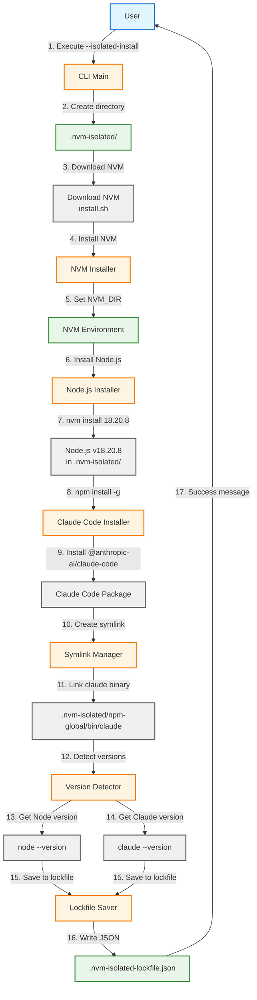
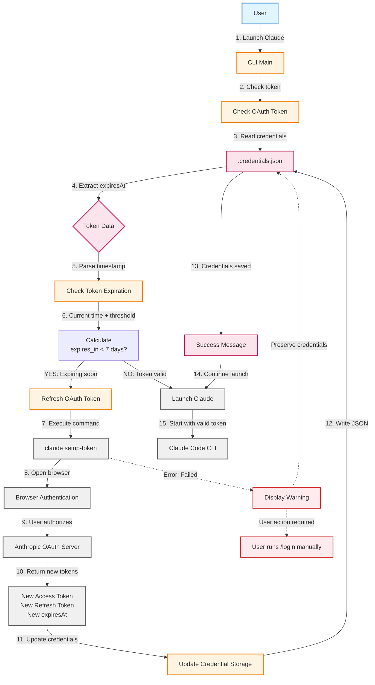

# Архитектурные диаграммы iclaude

Данный документ содержит визуализации ключевых процессов и зависимостей в проекте iclaude.

## Содержание

1. [Граф зависимостей компонентов](#граф-зависимостей-компонентов)
2. [Поток настройки прокси](#поток-настройки-прокси)
3. [Поток изолированной установки](#поток-изолированной-установки)
4. [Поток обновления OAuth токена](#поток-обновления-oauth-токена)
5. [Поток запуска через Router](#поток-запуска-через-router)

---

## Граф зависимостей компонентов

Показывает структуру модулей и их взаимосвязи в iclaude.sh.

**Легенда:**
- 🔵 CLI Layer — точка входа и обработка команд
- 🟠 Core Layer — основная бизнес-логика
- 🟢 Installation Layer — установка и обновление
- 🔴 Infrastructure Layer — низкоуровневые операции
- ⚪ External — внешние зависимости

```mermaid
graph TD
    %% CLI Layer
    CLI[cli-main<br/>Main Entry Point]
    USAGE[cli-usage<br/>Usage Display]

    %% Core Layer - Proxy Management
    PROXY[proxy-management<br/>Proxy Management]
    VALIDATE[validate-proxy-url<br/>URL Validator]
    RESOLVE[resolve-domain<br/>Domain Resolution]
    PARSE[parse-proxy-url<br/>URL Parser]
    CONFIG_PROXY[configure-proxy<br/>Environment Configurator]
    TEST_PROXY[test-proxy<br/>Connection Tester]

    %% Core Layer - Environment Management
    ISOLATED[isolated-environment<br/>Environment Manager]
    SETUP_NVM[setup-isolated-nvm<br/>NVM Setup]
    REPAIR[repair-isolated-env<br/>Environment Repair]
    CHECK_STATUS[check-isolated-status<br/>Status Checker]

    %% Core Layer - Version Management
    VERSION_MGT[version-management<br/>Version Manager]
    SAVE_LOCK[save-lockfile<br/>Lockfile Saver]
    INSTALL_LOCK[install-from-lockfile<br/>Lockfile Installer]

    %% Core Layer - Configuration Management
    CONFIG_MGT[config-management<br/>Config Manager]
    SETUP_CONFIG[setup-isolated-config<br/>Config Setup]
    EXPORT_IMPORT[export-import-config<br/>Config Migration]

    %% Core Layer - OAuth Token Management
    OAUTH[oauth-token-management<br/>Token Manager]
    CHECK_TOKEN[check-oauth-token<br/>Token Checker]
    REFRESH_TOKEN[refresh-oauth-token<br/>Token Refresher]
    CHECK_EXP[check-token-expiration<br/>Expiration Checker]

    %% Core Layer - Router Management
    ROUTER[router-management<br/>Router Manager]
    DETECT_ROUTER[detect-router<br/>Router Detector]
    GET_ROUTER[get-router-path<br/>Router Path Finder]
    CHECK_ROUTER[check-router-status<br/>Router Status]

    %% Installation Layer
    NVM_INST[nvm-installer<br/>NVM Installer]
    NODE_INST[nodejs-installer<br/>Node.js Installer]
    CLAUDE_INST[claude-installer<br/>Claude Installer]
    ROUTER_INST[router-installer<br/>Router Installer]
    UPDATER[claude-updater<br/>Claude Updater]
    CLEANUP[cleanup-old-installations<br/>Installation Cleaner]
    SYMLINK[symlink-manager<br/>Symlink Manager]
    NVM_DETECT[nvm-detector<br/>NVM Detector]
    CLAUDE_PATH[claude-path-finder<br/>Claude Path Finder]
    VERSION_DETECT[version-detector<br/>Version Detector]

    %% Infrastructure Layer
    CRED_STORE[credential-storage<br/>Credential Storage]
    GIT_PROXY[git-proxy-config<br/>Git Proxy Config]
    FILE_OPS[file-operations<br/>File Operations]
    JQ_VALID[jq-validator<br/>JQ Validator]
    DEP_CHECK[dependency-checker<br/>Dependency Checker]
    OUTPUT[output-formatters<br/>Output Formatters]

    %% External Dependencies
    CLAUDE_CLI[claude-cli<br/>Claude Code CLI]
    ROUTER_CLI[router-cli<br/>Router CLI]
    NVM_BIN[nvm-binary<br/>NVM Binary]
    GIT_BIN[git-binary<br/>Git Binary]
    CURL_BIN[curl-binary<br/>Curl Binary]
    JQ_BIN[jq-binary<br/>JQ Binary]

    %% Dependencies - CLI Layer
    CLI -->|routes to| PROXY
    CLI -->|routes to| ISOLATED
    CLI -->|routes to| VERSION_MGT
    CLI -.->|optional| OAUTH
    CLI -.->|optional| ROUTER

    %% Dependencies - Proxy Management
    PROXY --> VALIDATE
    PROXY -.-> RESOLVE
    PROXY --> CRED_STORE
    PROXY -.-> GIT_PROXY
    VALIDATE --> PARSE
    CONFIG_PROXY --> PARSE
    TEST_PROXY --> CONFIG_PROXY
    TEST_PROXY --> CURL_BIN

    %% Dependencies - Environment Management
    ISOLATED --> NVM_INST
    ISOLATED --> NODE_INST
    ISOLATED --> CLAUDE_INST
    ISOLATED --> VERSION_MGT
    ISOLATED --> SETUP_NVM
    ISOLATED --> REPAIR

    %% Dependencies - Version Management
    VERSION_MGT --> SAVE_LOCK
    VERSION_MGT --> INSTALL_LOCK
    SAVE_LOCK --> VERSION_DETECT
    INSTALL_LOCK --> NVM_INST
    INSTALL_LOCK --> NODE_INST
    INSTALL_LOCK --> CLAUDE_INST
    INSTALL_LOCK -.-> ROUTER_INST

    %% Dependencies - OAuth Management
    OAUTH --> CHECK_TOKEN
    CHECK_TOKEN --> CHECK_EXP
    CHECK_TOKEN -.-> REFRESH_TOKEN
    REFRESH_TOKEN --> CLAUDE_CLI
    OAUTH --> CRED_STORE
    OAUTH --> JQ_VALID

    %% Dependencies - Router Management
    ROUTER --> DETECT_ROUTER
    ROUTER --> GET_ROUTER
    ROUTER -.-> ROUTER_INST
    DETECT_ROUTER --> GET_ROUTER
    CHECK_ROUTER --> JQ_VALID

    %% Dependencies - Installation Layer
    CLAUDE_INST --> NODE_INST
    CLAUDE_INST --> SYMLINK
    ROUTER_INST --> NODE_INST
    ROUTER_INST --> SYMLINK
    NODE_INST --> NVM_INST
    UPDATER --> CLEANUP
    UPDATER --> SYMLINK
    UPDATER --> SAVE_LOCK
    CLAUDE_PATH --> NVM_DETECT
    VERSION_DETECT --> CLAUDE_PATH

    %% Dependencies - Infrastructure
    GIT_PROXY --> GIT_BIN
    CONFIG_MGT --> FILE_OPS

    %% Layer Styling
    classDef cliLayer fill:#e1f5ff,stroke:#1976d2,stroke-width:2px
    classDef coreLayer fill:#fff4e1,stroke:#f57c00,stroke-width:2px
    classDef installLayer fill:#e8f5e9,stroke:#388e3c,stroke-width:2px
    classDef infraLayer fill:#fce4ec,stroke:#c2185b,stroke-width:2px
    classDef externalLayer fill:#f0f0f0,stroke:#616161,stroke-width:2px

    class CLI,USAGE cliLayer
    class PROXY,VALIDATE,RESOLVE,PARSE,CONFIG_PROXY,TEST_PROXY,ISOLATED,SETUP_NVM,REPAIR,CHECK_STATUS,VERSION_MGT,SAVE_LOCK,INSTALL_LOCK,CONFIG_MGT,SETUP_CONFIG,EXPORT_IMPORT,OAUTH,CHECK_TOKEN,REFRESH_TOKEN,CHECK_EXP,ROUTER,DETECT_ROUTER,GET_ROUTER,CHECK_ROUTER coreLayer
    class NVM_INST,NODE_INST,CLAUDE_INST,ROUTER_INST,UPDATER,CLEANUP,SYMLINK,NVM_DETECT,CLAUDE_PATH,VERSION_DETECT installLayer
    class CRED_STORE,GIT_PROXY,FILE_OPS,JQ_VALID,DEP_CHECK,OUTPUT infraLayer
    class CLAUDE_CLI,ROUTER_CLI,NVM_BIN,GIT_BIN,CURL_BIN,JQ_BIN externalLayer
```

---

## Поток настройки прокси

Описывает процесс конфигурации HTTP/HTTPS прокси от ввода URL до запуска Claude Code.

**Ключевые этапы:**
1. Валидация формата URL
2. Обработка протокола (HTTP vs HTTPS)
3. Сохранение учётных данных
4. Тестирование соединения
5. Запуск Claude Code

```mermaid
graph LR
    %% Proxy Configuration Flow
    USER[User] -->|1. Provides proxy URL| CLI[CLI Main]
    CLI -->|2. Validate format| VALIDATE[Validate Proxy URL]
    VALIDATE -->|3. Check protocol| PROTOCOL{Protocol?}

    PROTOCOL -->|HTTP| RESOLVE[Resolve Domain<br/>to IP]
    PROTOCOL -->|HTTPS| PARSE[Parse Proxy URL]
    RESOLVE -->|4. Convert domain| PARSE

    PARSE -->|5. Extract credentials| CRED[Credential Storage]
    CRED -->|6. Save credentials<br/>chmod 600| FILE[.claude_proxy_credentials]

    FILE -->|7. Load credentials| CONFIG[Configure Proxy]
    CONFIG -->|8. Set environment<br/>variables| ENV[HTTPS_PROXY<br/>HTTP_PROXY<br/>NO_PROXY]

    ENV -->|9. Test connectivity| TEST[Test Proxy]
    TEST -->|10. HTTP request| HTTP_TEST[http://www.google.com]
    TEST -->|11. HTTPS request| HTTPS_TEST[https://www.anthropic.com]

    HTTP_TEST -->|12. Success| LAUNCH[Launch Claude]
    HTTPS_TEST -->|12. Success| LAUNCH

    LAUNCH -->|13. Start with proxy| CLAUDE[Claude Code CLI]

    %% Styling
    classDef userClass fill:#e1f5ff,stroke:#1976d2,stroke-width:2px
    classDef processClass fill:#fff4e1,stroke:#f57c00,stroke-width:2px
    classDef storageClass fill:#fce4ec,stroke:#c2185b,stroke-width:2px
    classDef externalClass fill:#f0f0f0,stroke:#616161,stroke-width:2px

    class USER userClass
    class CLI,VALIDATE,RESOLVE,PARSE,CONFIG,TEST processClass
    class CRED,FILE,ENV storageClass
    class HTTP_TEST,HTTPS_TEST,CLAUDE externalClass
```

---

## Поток изолированной установки

Показывает процесс установки изолированного окружения с NVM, Node.js и Claude Code.

**Создаваемые артефакты:**
- `.nvm-isolated/` — директория окружения
- `versions/node/v18.x.x/` — Node.js
- `npm-global/bin/claude` — симлинк на CLI
- `.nvm-isolated-lockfile.json` — файл версий

---

## Поток обновления OAuth токена

Описывает автоматическую проверку и обновление OAuth токена при запуске.

**Важные моменты:**
- Токен проверяется при каждом запуске
- Автоматическое обновление за 7 дней до истечения
- Новый токен действителен ~1 год
- При ошибке credentials не удаляются

---

## Поток запуска через Router

Показывает процесс запуска Claude Code через Router для использования альтернативных LLM-провайдеров.

**Поддерживаемые провайдеры:**
- DeepSeek
- OpenRouter
- Ollama (локальный)
- Google Gemini
- Anthropic (через прокси)

```mermaid
graph LR
    %% Router Launch Flow
    USER[User] -->|1. Launch with --router flag| CLI[CLI Main]
    CLI -->|2. Check router availability| DETECT[Detect Router]

    DETECT -->|3. Check config exists| CONFIG_CHECK{router.json<br/>exists?}
    DETECT -->|4. Check binary exists| BIN_CHECK{ccr binary<br/>exists?}

    CONFIG_CHECK -->|NO| ERROR[Error: Router not installed]
    BIN_CHECK -->|NO| ERROR

    CONFIG_CHECK -->|YES| COPY[Copy Config]
    BIN_CHECK -->|YES| COPY

    COPY -->|5. Copy router.json| DEST[~/.claude-code-router/config.json]
    DEST -->|6. Read config| ROUTER_CONFIG[Router Configuration<br/>providers, models, API keys]

    ROUTER_CONFIG -->|7. Load proxy settings| PROXY[Configure Proxy<br/>Environment Variables]
    PROXY -->|8. Set HTTPS_PROXY| ENV[Environment<br/>HTTPS_PROXY<br/>HTTP_PROXY]

    ENV -->|9. Launch router| ROUTER_CLI[ccr code]
    ROUTER_CLI -->|10. Start router service| ROUTER_SERVICE[Claude Code Router Service]

    ROUTER_SERVICE -->|11. Intercept API calls| INTERCEPT[API Call Interceptor]
    INTERCEPT -->|12. Route to provider| PROVIDER{Configured<br/>Provider}

    PROVIDER -->|DeepSeek| DEEPSEEK[DeepSeek API]
    PROVIDER -->|OpenRouter| OPENROUTER[OpenRouter API]
    PROVIDER -->|Ollama| OLLAMA[Ollama Local]
    PROVIDER -->|Gemini| GEMINI[Google Gemini API]
    PROVIDER -->|Claude| ANTHROPIC[Anthropic API<br/>via proxy]

    DEEPSEEK -->|Response| RESPONSE[Format Response]
    OPENROUTER -->|Response| RESPONSE
    OLLAMA -->|Response| RESPONSE
    GEMINI -->|Response| RESPONSE
    ANTHROPIC -->|Response| RESPONSE

    RESPONSE -->|13. Return to client| CLAUDE[Claude Code CLI]
    CLAUDE -->|14. Display to user| USER

    %% Styling
    classDef userClass fill:#e1f5ff,stroke:#1976d2,stroke-width:2px
    classDef processClass fill:#fff4e1,stroke:#f57c00,stroke-width:2px
    classDef storageClass fill:#e8f5e9,stroke:#388e3c,stroke-width:2px
    classDef providerClass fill:#f3e5f5,stroke:#7b1fa2,stroke-width:2px
    classDef errorClass fill:#ffebee,stroke:#d32f2f,stroke-width:2px

    class USER userClass
    class CLI,DETECT,COPY,PROXY,INTERCEPT,RESPONSE processClass
    class DEST,ROUTER_CONFIG,ENV storageClass
    class ROUTER_CLI,ROUTER_SERVICE,DEEPSEEK,OPENROUTER,OLLAMA,GEMINI,ANTHROPIC,CLAUDE providerClass
    class ERROR errorClass
```

---

## Исходные файлы

Оригинальные Mermaid диаграммы находятся в этой же директории:

| Файл | Описание |
|------|----------|
| `dependency-graph.mmd` | Граф зависимостей компонентов |
| `data-flow-proxy-configuration.mmd` | Поток настройки прокси |
| `data-flow-isolated-installation.mmd` | Поток изолированной установки |
| `data-flow-oauth-token-refresh.mmd` | Поток обновления OAuth токена |
| `data-flow-router-launch.mmd` | Поток запуска через Router |

## Просмотр диаграмм

Для просмотра диаграмм используйте:
- GitHub (автоматический рендеринг Mermaid в .md файлах)
- VS Code с расширением Mermaid Preview
- [Mermaid Live Editor](https://mermaid.live/)
- Obsidian или другие Markdown редакторы с поддержкой Mermaid
