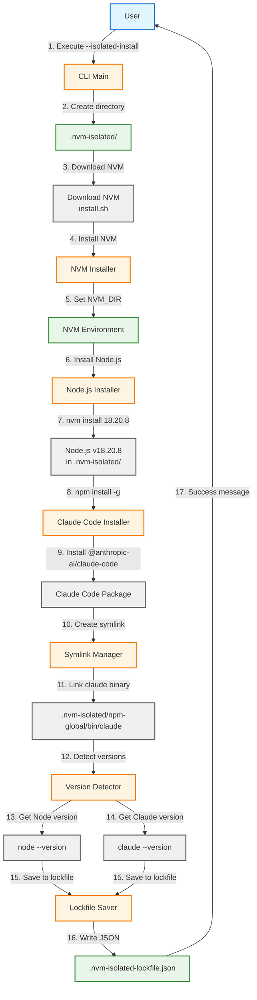

# Поток изолированной установки

Показывает процесс установки изолированного окружения с NVM, Node.js и Claude Code.

## Создаваемые артефакты

| Путь | Описание |
|------|----------|
| `.nvm-isolated/` | Корневая директория окружения |
| `.nvm-isolated/nvm.sh` | Скрипт NVM |
| `.nvm-isolated/versions/node/v18.x.x/` | Установка Node.js |
| `.nvm-isolated/npm-global/bin/claude` | Симлинк на CLI |
| `.nvm-isolated/.claude-isolated/` | Изолированная конфигурация |
| `.nvm-isolated-lockfile.json` | Файл версий |

## Диаграмма



## Этапы установки

### 1. Создание директории
```bash
mkdir -p .nvm-isolated
```

### 2-4. Установка NVM
- Скачивание `install.sh` с GitHub
- Установка в `.nvm-isolated/`
- Конфигурация `NVM_DIR`

### 5-7. Установка Node.js
```bash
nvm install 18.20.8
```

### 8-9. Установка Claude Code
```bash
npm install -g @anthropic-ai/claude-code
```

### 10-11. Создание симлинков
```bash
ln -s ../../versions/node/v18.x.x/lib/node_modules/@anthropic-ai/claude-code/cli.js \
      .nvm-isolated/npm-global/bin/claude
```

### 12-16. Сохранение версий
Lockfile записывается в формате JSON:
```json
{
  "nodeVersion": "18.20.8",
  "claudeCodeVersion": "2.1.7",
  "installedAt": "2026-01-14T10:39:51Z",
  "nvmVersion": "0.39.7"
}
```

## Восстановление после git clone

После клонирования репозитория симлинки могут быть сломаны. Для восстановления:

```bash
./iclaude.sh --repair-isolated
```

Это пересоздаст все необходимые симлинки.
