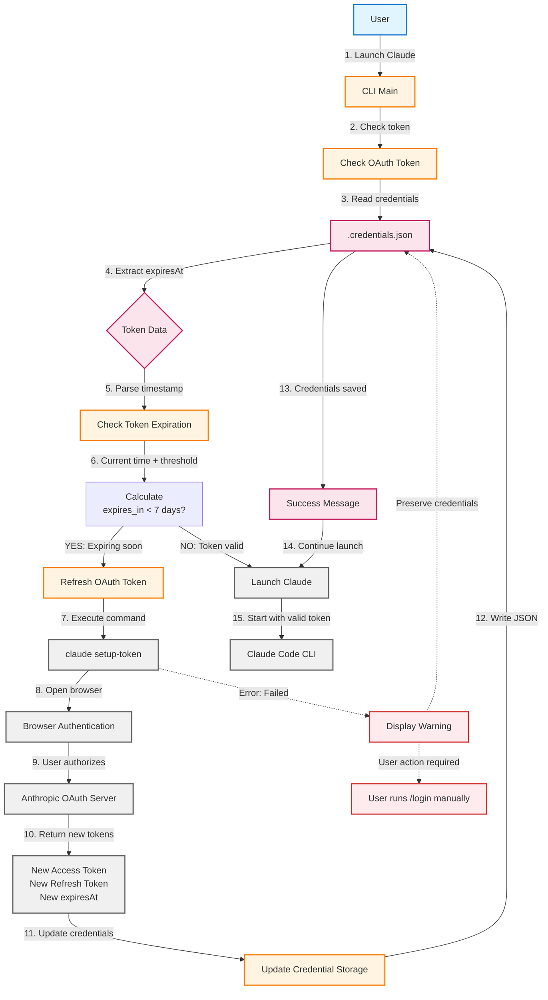

# Поток обновления OAuth токена

Описывает автоматическую проверку и обновление OAuth токена при запуске.

## Ключевые особенности

- Токен проверяется при **каждом** запуске
- Автоматическое обновление за **7 дней** до истечения (настраивается)
- Новый токен действителен **~1 год**
- При ошибке credentials **не удаляются** (сохраняется refreshToken)

## Диаграмма



## Структура токена

Файл `.credentials.json`:
```json
{
  "claudeAiOauth": {
    "accessToken": "sk-ant-oat01-...",
    "refreshToken": "sk-ant-ort01-...",
    "expiresAt": 1766460813792,
    "scopes": ["user:inference", "user:profile", "user:sessions:claude_code"],
    "subscriptionType": "max"
  }
}
```

## Алгоритм проверки

```
current_time = now()
expires_at = credentials.claudeAiOauth.expiresAt
threshold = 7 * 24 * 60 * 60 * 1000  # 7 дней в миллисекундах

if (expires_at - current_time) < threshold:
    refresh_token()
else:
    launch_claude()
```

## Обработка ошибок

При неудачном обновлении токена:

1. **Credentials сохраняются** — refreshToken остаётся в файле
2. **Выводится предупреждение** — пользователь информируется о проблеме
3. **Claude Code может продолжить работу** — используя внутренний механизм refresh

### Ручное обновление

Если автоматическое обновление не сработало:

```bash
# Ручной refresh через iclaude
./iclaude.sh --refresh-token

# Или внутри Claude Code
/login
```

## Конфигурация

Порог обновления настраивается константой в `iclaude.sh`:

```bash
TOKEN_REFRESH_THRESHOLD=604800  # 7 дней в секундах
```

## Ограничения

- `setup-token` требует **интерактивной** браузерной аутентификации
- Не подходит для полностью headless/CI окружений
- Требуется доступ к GUI для открытия браузера
