# Поток запуска через Router

Показывает процесс запуска Claude Code через Router для использования альтернативных LLM-провайдеров.

## Поддерживаемые провайдеры

| Провайдер | Описание |
|-----------|----------|
| DeepSeek | DeepSeek API |
| OpenRouter | Агрегатор моделей |
| Ollama | Локальные модели |
| Gemini | Google Gemini API |
| Anthropic | Нативный Claude (через прокси) |
| Volcengine | ByteDance Cloud |
| SiliconFlow | SiliconFlow API |

## Диаграмма

```mermaid
graph LR
    %% Router Launch Flow
    USER[User] -->|1. Launch with --router flag| CLI[CLI Main]
    CLI -->|2. Check router availability| DETECT[Detect Router]

    DETECT -->|3. Check config exists| CONFIG_CHECK{router.json<br/>exists?}
    DETECT -->|4. Check binary exists| BIN_CHECK{ccr binary<br/>exists?}

    CONFIG_CHECK -->|NO| ERROR[Error: Router not installed]
    BIN_CHECK -->|NO| ERROR

    CONFIG_CHECK -->|YES| COPY[Copy Config]
    BIN_CHECK -->|YES| COPY

    COPY -->|5. Copy router.json| DEST[~/.claude-code-router/config.json]
    DEST -->|6. Read config| ROUTER_CONFIG[Router Configuration<br/>providers, models, API keys]

    ROUTER_CONFIG -->|7. Load proxy settings| PROXY[Configure Proxy<br/>Environment Variables]
    PROXY -->|8. Set HTTPS_PROXY| ENV[Environment<br/>HTTPS_PROXY<br/>HTTP_PROXY]

    ENV -->|9. Launch router| ROUTER_CLI[ccr code]
    ROUTER_CLI -->|10. Start router service| ROUTER_SERVICE[Claude Code Router Service]

    ROUTER_SERVICE -->|11. Intercept API calls| INTERCEPT[API Call Interceptor]
    INTERCEPT -->|12. Route to provider| PROVIDER{Configured<br/>Provider}

    PROVIDER -->|DeepSeek| DEEPSEEK[DeepSeek API]
    PROVIDER -->|OpenRouter| OPENROUTER[OpenRouter API]
    PROVIDER -->|Ollama| OLLAMA[Ollama Local]
    PROVIDER -->|Gemini| GEMINI[Google Gemini API]
    PROVIDER -->|Claude| ANTHROPIC[Anthropic API<br/>via proxy]

    DEEPSEEK -->|Response| RESPONSE[Format Response]
    OPENROUTER -->|Response| RESPONSE
    OLLAMA -->|Response| RESPONSE
    GEMINI -->|Response| RESPONSE
    ANTHROPIC -->|Response| RESPONSE

    RESPONSE -->|13. Return to client| CLAUDE[Claude Code CLI]
    CLAUDE -->|14. Display to user| USER

    %% Styling
    classDef userClass fill:#e1f5ff,stroke:#1976d2,stroke-width:2px
    classDef processClass fill:#fff4e1,stroke:#f57c00,stroke-width:2px
    classDef storageClass fill:#e8f5e9,stroke:#388e3c,stroke-width:2px
    classDef providerClass fill:#f3e5f5,stroke:#7b1fa2,stroke-width:2px
    classDef errorClass fill:#ffebee,stroke:#d32f2f,stroke-width:2px

    class USER userClass
    class CLI,DETECT,COPY,PROXY,INTERCEPT,RESPONSE processClass
    class DEST,ROUTER_CONFIG,ENV storageClass
    class ROUTER_CLI,ROUTER_SERVICE,DEEPSEEK,OPENROUTER,OLLAMA,GEMINI,ANTHROPIC,CLAUDE providerClass
    class ERROR errorClass
```



## Активация Router

Router активируется **только** с флагом `--router`:

```bash
# Запуск через Router
./iclaude.sh --router

# Запуск нативного Claude (по умолчанию)
./iclaude.sh
```

## Конфигурационные файлы

| Файл | Описание | В Git? |
|------|----------|--------|
| `router.json.example` | Шаблон со всеми провайдерами | Да |
| `router.json` | Конфигурация с `${VAR}` плейсхолдерами | Да |
| `~/.claude-code-router/config.json` | Runtime конфигурация | Нет |

## Подстановка переменных окружения

В `router.json` можно использовать плейсхолдеры:

```json
{
  "providers": {
    "deepseek": {
      "apiKey": "${DEEPSEEK_API_KEY}"
    }
  }
}
```

При запуске `${DEEPSEEK_API_KEY}` заменяется на значение из окружения.

## Совместимость с прокси

Router автоматически наследует переменные прокси:
- `HTTPS_PROXY`
- `HTTP_PROXY`

Специальная настройка не требуется.

## Установка Router

```bash
# Установка в изолированное окружение
./iclaude.sh --install-router

# Проверка статуса
./iclaude.sh --check-router
```

## Проверка статуса

Команда `--check-router` показывает:
- Статус установки
- Версию Router
- Путь к конфигурации
- Список настроенных провайдеров
- Модель по умолчанию

## Поток данных

1. Пользователь запускает `./iclaude.sh --router`
2. Скрипт проверяет наличие `router.json` и бинарника `ccr`
3. Копирует конфигурацию в `~/.claude-code-router/config.json`
4. Запускает `ccr code` вместо `claude`
5. Router перехватывает API вызовы
6. Маршрутизирует к настроенному провайдеру
7. Форматирует ответ и возвращает Claude Code CLI
