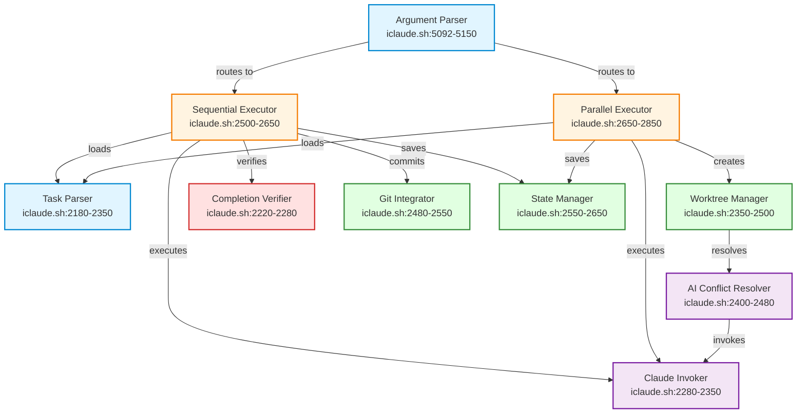

# Loop Mode Component Dependency Graph

**Generated:** 2026-01-25
**Version:** 1.0.0

This diagram visualizes the dependencies between loop mode components in iclaude.sh.

## Component Dependency Graph

