# Граф зависимостей компонентов

Показывает структуру модулей и их взаимосвязи в iclaude.sh.

## Легенда

| Цвет | Слой | Описание |
|------|------|----------|
| 🔵 Голубой | CLI Layer | Точка входа и обработка команд |
| 🟠 Оранжевый | Core Layer | Основная бизнес-логика |
| 🟢 Зелёный | Installation Layer | Установка и обновление компонентов |
| 🔴 Розовый | Infrastructure Layer | Низкоуровневые операции |
| ⚪ Серый | External | Внешние зависимости |

## Диаграмма

```mermaid
graph TD
    %% CLI Layer
    CLI[cli-main<br/>Main Entry Point]
    USAGE[cli-usage<br/>Usage Display]

    %% Core Layer - Proxy Management
    PROXY[proxy-management<br/>Proxy Management]
    VALIDATE[validate-proxy-url<br/>URL Validator]
    RESOLVE[resolve-domain<br/>Domain Resolution]
    PARSE[parse-proxy-url<br/>URL Parser]
    CONFIG_PROXY[configure-proxy<br/>Environment Configurator]
    TEST_PROXY[test-proxy<br/>Connection Tester]

    %% Core Layer - Environment Management
    ISOLATED[isolated-environment<br/>Environment Manager]
    SETUP_NVM[setup-isolated-nvm<br/>NVM Setup]
    REPAIR[repair-isolated-env<br/>Environment Repair]
    CHECK_STATUS[check-isolated-status<br/>Status Checker]

    %% Core Layer - Version Management
    VERSION_MGT[version-management<br/>Version Manager]
    SAVE_LOCK[save-lockfile<br/>Lockfile Saver]
    INSTALL_LOCK[install-from-lockfile<br/>Lockfile Installer]

    %% Core Layer - Configuration Management
    CONFIG_MGT[config-management<br/>Config Manager]
    SETUP_CONFIG[setup-isolated-config<br/>Config Setup]
    EXPORT_IMPORT[export-import-config<br/>Config Migration]

    %% Core Layer - OAuth Token Management
    OAUTH[oauth-token-management<br/>Token Manager]
    CHECK_TOKEN[check-oauth-token<br/>Token Checker]
    REFRESH_TOKEN[refresh-oauth-token<br/>Token Refresher]
    CHECK_EXP[check-token-expiration<br/>Expiration Checker]

    %% Core Layer - Router Management
    ROUTER[router-management<br/>Router Manager]
    DETECT_ROUTER[detect-router<br/>Router Detector]
    GET_ROUTER[get-router-path<br/>Router Path Finder]
    CHECK_ROUTER[check-router-status<br/>Router Status]

    %% Installation Layer
    NVM_INST[nvm-installer<br/>NVM Installer]
    NODE_INST[nodejs-installer<br/>Node.js Installer]
    CLAUDE_INST[claude-installer<br/>Claude Installer]
    ROUTER_INST[router-installer<br/>Router Installer]
    UPDATER[claude-updater<br/>Claude Updater]
    CLEANUP[cleanup-old-installations<br/>Installation Cleaner]
    SYMLINK[symlink-manager<br/>Symlink Manager]
    NVM_DETECT[nvm-detector<br/>NVM Detector]
    CLAUDE_PATH[claude-path-finder<br/>Claude Path Finder]
    VERSION_DETECT[version-detector<br/>Version Detector]

    %% Infrastructure Layer
    CRED_STORE[credential-storage<br/>Credential Storage]
    GIT_PROXY[git-proxy-config<br/>Git Proxy Config]
    FILE_OPS[file-operations<br/>File Operations]
    JQ_VALID[jq-validator<br/>JQ Validator]
    DEP_CHECK[dependency-checker<br/>Dependency Checker]
    OUTPUT[output-formatters<br/>Output Formatters]

    %% External Dependencies
    CLAUDE_CLI[claude-cli<br/>Claude Code CLI]
    ROUTER_CLI[router-cli<br/>Router CLI]
    NVM_BIN[nvm-binary<br/>NVM Binary]
    GIT_BIN[git-binary<br/>Git Binary]
    CURL_BIN[curl-binary<br/>Curl Binary]
    JQ_BIN[jq-binary<br/>JQ Binary]

    %% Dependencies - CLI Layer
    CLI -->|routes to| PROXY
    CLI -->|routes to| ISOLATED
    CLI -->|routes to| VERSION_MGT
    CLI -.->|optional| OAUTH
    CLI -.->|optional| ROUTER

    %% Dependencies - Proxy Management
    PROXY --> VALIDATE
    PROXY -.-> RESOLVE
    PROXY --> CRED_STORE
    PROXY -.-> GIT_PROXY
    VALIDATE --> PARSE
    CONFIG_PROXY --> PARSE
    TEST_PROXY --> CONFIG_PROXY
    TEST_PROXY --> CURL_BIN

    %% Dependencies - Environment Management
    ISOLATED --> NVM_INST
    ISOLATED --> NODE_INST
    ISOLATED --> CLAUDE_INST
    ISOLATED --> VERSION_MGT
    ISOLATED --> SETUP_NVM
    ISOLATED --> REPAIR

    %% Dependencies - Version Management
    VERSION_MGT --> SAVE_LOCK
    VERSION_MGT --> INSTALL_LOCK
    SAVE_LOCK --> VERSION_DETECT
    INSTALL_LOCK --> NVM_INST
    INSTALL_LOCK --> NODE_INST
    INSTALL_LOCK --> CLAUDE_INST
    INSTALL_LOCK -.-> ROUTER_INST

    %% Dependencies - OAuth Management
    OAUTH --> CHECK_TOKEN
    CHECK_TOKEN --> CHECK_EXP
    CHECK_TOKEN -.-> REFRESH_TOKEN
    REFRESH_TOKEN --> CLAUDE_CLI
    OAUTH --> CRED_STORE
    OAUTH --> JQ_VALID

    %% Dependencies - Router Management
    ROUTER --> DETECT_ROUTER
    ROUTER --> GET_ROUTER
    ROUTER -.-> ROUTER_INST
    DETECT_ROUTER --> GET_ROUTER
    CHECK_ROUTER --> JQ_VALID

    %% Dependencies - Installation Layer
    CLAUDE_INST --> NODE_INST
    CLAUDE_INST --> SYMLINK
    ROUTER_INST --> NODE_INST
    ROUTER_INST --> SYMLINK
    NODE_INST --> NVM_INST
    UPDATER --> CLEANUP
    UPDATER --> SYMLINK
    UPDATER --> SAVE_LOCK
    CLAUDE_PATH --> NVM_DETECT
    VERSION_DETECT --> CLAUDE_PATH

    %% Dependencies - Infrastructure
    GIT_PROXY --> GIT_BIN
    CONFIG_MGT --> FILE_OPS

    %% Layer Styling
    classDef cliLayer fill:#e1f5ff,stroke:#1976d2,stroke-width:2px
    classDef coreLayer fill:#fff4e1,stroke:#f57c00,stroke-width:2px
    classDef installLayer fill:#e8f5e9,stroke:#388e3c,stroke-width:2px
    classDef infraLayer fill:#fce4ec,stroke:#c2185b,stroke-width:2px
    classDef externalLayer fill:#f0f0f0,stroke:#616161,stroke-width:2px

    class CLI,USAGE cliLayer
    class PROXY,VALIDATE,RESOLVE,PARSE,CONFIG_PROXY,TEST_PROXY,ISOLATED,SETUP_NVM,REPAIR,CHECK_STATUS,VERSION_MGT,SAVE_LOCK,INSTALL_LOCK,CONFIG_MGT,SETUP_CONFIG,EXPORT_IMPORT,OAUTH,CHECK_TOKEN,REFRESH_TOKEN,CHECK_EXP,ROUTER,DETECT_ROUTER,GET_ROUTER,CHECK_ROUTER coreLayer
    class NVM_INST,NODE_INST,CLAUDE_INST,ROUTER_INST,UPDATER,CLEANUP,SYMLINK,NVM_DETECT,CLAUDE_PATH,VERSION_DETECT installLayer
    class CRED_STORE,GIT_PROXY,FILE_OPS,JQ_VALID,DEP_CHECK,OUTPUT infraLayer
    class CLAUDE_CLI,ROUTER_CLI,NVM_BIN,GIT_BIN,CURL_BIN,JQ_BIN externalLayer
```

## Описание слоёв

### CLI Layer
Точка входа в приложение. Парсит аргументы командной строки и маршрутизирует к соответствующим модулям.

### Core Layer
Основная бизнес-логика, разделённая на модули:
- **Proxy Management** — валидация, парсинг и настройка прокси
- **Environment Management** — управление изолированным окружением
- **Version Management** — работа с lockfile и версиями
- **Configuration Management** — изоляция конфигурации
- **OAuth Token Management** — проверка и обновление токенов
- **Router Management** — интеграция с Claude Code Router

### Installation Layer
Компоненты установки и обновления:
- NVM, Node.js, Claude Code installers
- Symlink manager для создания/восстановления симлинков
- Updater для обновления Claude Code

### Infrastructure Layer
Низкоуровневые операции:
- Credential storage — безопасное хранение учётных данных
- File operations — работа с файловой системой
- JQ validator — валидация JSON

### External
Внешние зависимости, которые должны быть установлены в системе.
