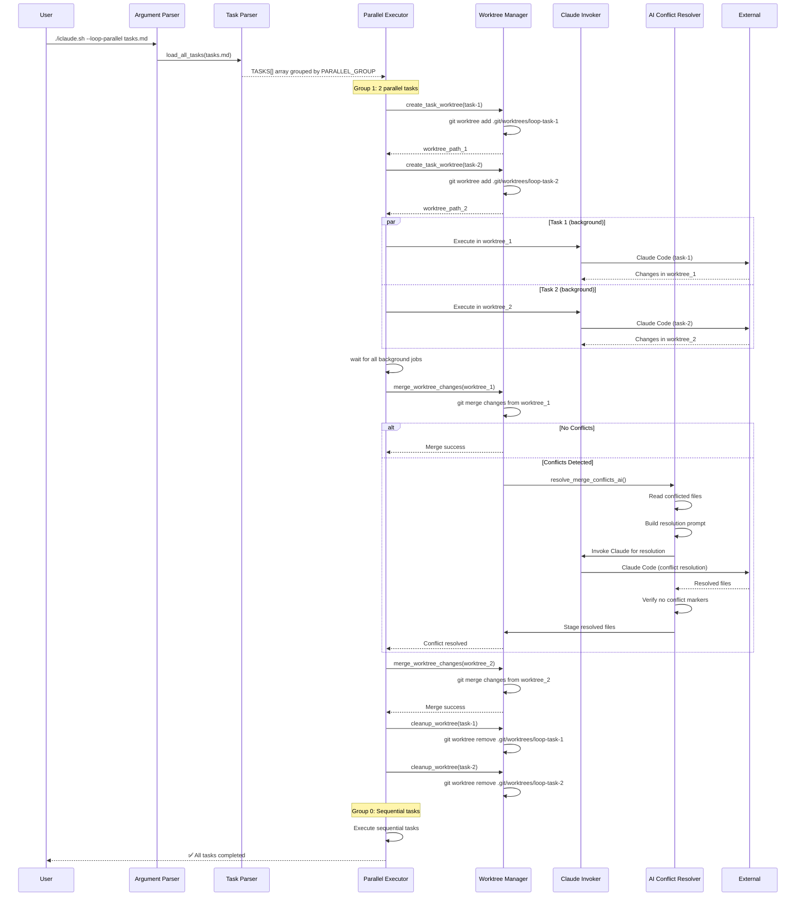

# Parallel Execution Flow

**Generated:** 2026-01-25

This diagram shows the parallel task execution flow with git worktree isolation.



## Parallel Execution Phases

1. **Task Loading:** Parse multiple "# Task:" sections from Markdown
2. **Grouping:** Group tasks by PARALLEL_GROUP field (0 = sequential, 1+ = parallel)
3. **Worktree Creation:** Create isolated git worktrees for each parallel task
4. **Background Execution:** Spawn Claude Code in background (max 5 parallel)
5. **Synchronization:** Wait for all background jobs to complete
6. **Merging:** Merge changes from worktrees back to main working tree
7. **Conflict Resolution:** AI-assisted resolution if merge conflicts detected
8. **Cleanup:** Remove temporary worktrees after successful merge
9. **Sequential Tasks:** Execute Group 0 tasks sequentially after parallel group
10. **Exit:** Return 0 (success), 2 (partial), or 4 (unresolved conflicts)

## Worktree Structure

```
project/
├── .git/
│   └── worktrees/
│       ├── loop-task-1-1738012345/
│       │   ├── HEAD
│       │   └── gitdir
│       └── loop-task-2-1738012346/
│           ├── HEAD
│           └── gitdir
├── (main working tree)
└── task-1/ (worktree 1)
    └── task-2/ (worktree 2)
```

## AI Conflict Resolution

When merge conflicts occur:
1. Detect conflicts: `git diff --name-only --diff-filter=U`
2. Read conflicted file with markers
3. Build prompt: "Resolve git conflict in {file}..."
4. Invoke Claude Code to generate resolved content
5. Verify no markers remain: `! grep -E "^<<<<<<<|^=======|^>>>>>>>" file`
6. Stage resolved file: `git add file`
7. Complete merge: `git commit --no-edit`
