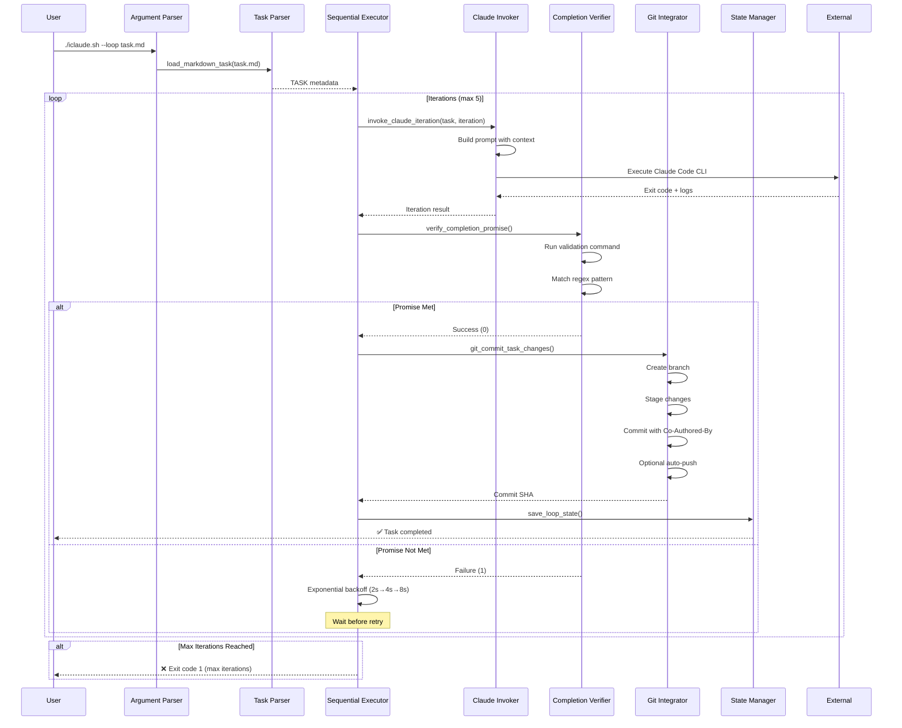

# Sequential Execution Flow

**Generated:** 2026-01-25

This diagram shows the sequential task execution flow from user invocation to completion.

## Flow Steps

1. **User Invocation:** `./iclaude.sh --loop task.md`
2. **Argument Parsing:** Detect `--loop` flag, extract task file path
3. **Task Loading:** Parse Markdown to extract task metadata
4. **Iteration Loop:** Execute up to max iterations (default 5)
   - Invoke Claude Code for task execution
   - Verify completion promise via validation command
   - On success: commit changes and exit
   - On failure: wait (exponential backoff) and retry
5. **Git Integration:** Create branch, commit with Co-Authored-By, optional push
6. **State Persistence:** Save loop state for recovery
7. **Exit:** Return 0 (success) or 1 (max iterations reached)

## Exponential Backoff

| Iteration | Delay Before Retry |
|-----------|-------------------|
| 1 → 2 | 2 seconds |
| 2 → 3 | 4 seconds |
| 3 → 4 | 8 seconds |
| 4 → 5 | 16 seconds |
| 5 → Max | 32 seconds (capped at 60s) |
